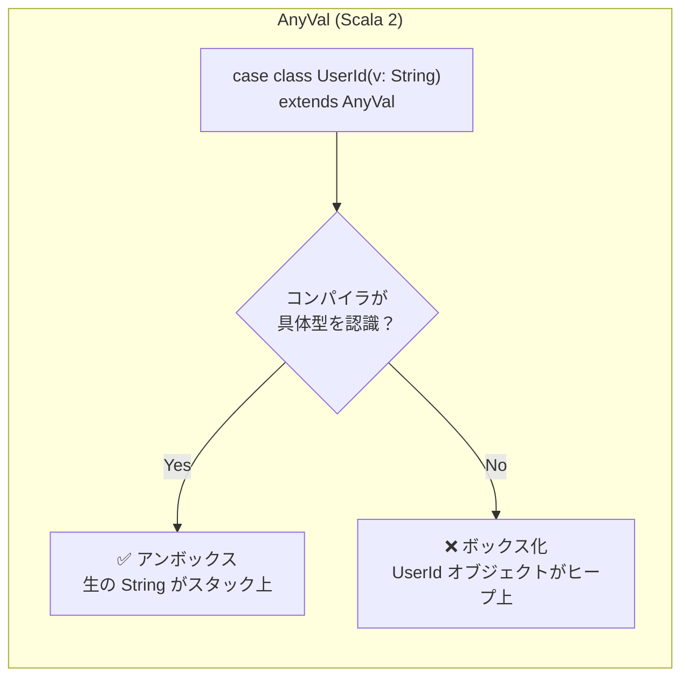
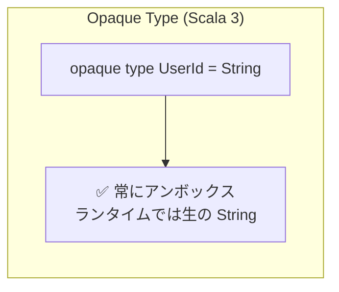

# Scala 3 Opaque Type のためのゼロコスト型クラス導出

[English](README.md)

## これは何か

このプロジェクトは、Scala 3 の **opaque type に対する型クラスインスタンスの自動導出パターン** を示しています。型ごとに個別のインスタンスを書く必要がなく、ランタイムオーバーヘッドもゼロです。

このパターンは、Pekko Cluster で構築されたプログラマティック広告プラットフォームの実際の問題から生まれました。このシステムでは多数の opaque type — 広告主ID、キャンペーンID、クリエイティブID、サイトID、CPM、予算、支出追跡など — を定義しており、それらすべてに Spray JSON API 用の `JsonFormat` インスタンス、ソート済みコレクション用の `Ordering`、Pekko クラスタ通信用のシリアライゼーションサポートが必要です。すべての opaque type が同じ機械的な配線を抱えていました：

```scala
object CampaignId {
  opaque type CampaignId = String
  def apply(value: String): CampaignId = value              // String → CampaignId にラップ
  extension (id: CampaignId) { def value: String = id }     // ① アンラップアクセサ
  given Ordering[CampaignId] = Ordering.String.on(_.value)   // ② 手書きの Ordering
  given JsonFormat[CampaignId] with {                        // ③ 手書きの JsonFormat
    def write(id: CampaignId) = JsString(id.value)           //   （8行のボイラープレート）
    def read(json: JsValue) = json match {
      case JsString(s) => CampaignId(s)
      case other => deserializationError(s"Expected string, got $other")
    }
  }
}
```

`.value` エクステンション ① は、外部コードが基底の `String` を取り出す唯一の方法です。これがなければ `Ordering` ② も `JsonFormat` ③ も配線できません — 基底の値にアクセスする必要があるすべての型クラスがこの手書きアクセサに依存し、すべての opaque type がそれを提供しなければなりません。

これを15以上の型に掛け合わせ、新しい型クラス（データベースカラムマッパー、protobuf コーデック、ログフォーマッタなど）を追加するたびに、型ごとのコストがさらに増えます。実装は毎回同一で、変わるのは型名だけです。`CPM` の算術演算や `URL.domain` の抽出のようなドメイン固有のロジックは確かに手書きが必要ですが、`JsonFormat` や `Ordering` の行は純粋なボイラープレートです。

ここで説明するパターンを使えば、各コンパニオンオブジェクトはエビデンスのエクスポート1行にまで縮小されます：

```scala
object CampaignId {
  opaque type CampaignId = String
  def apply(value: String): CampaignId = value
  given CampaignId =:= String = summon                       // ①②③ を置き換え
}
```

各ボイラープレートの対応関係は以下の通りです：

| Before（型ごとに手書き） | After（`=:=` から導出） |
|---|---|
| ① `extension (id: CampaignId) { def value: String = id }` | 不要 — ②③ は `.value` でアンラップするために存在していたが、汎用導出ルールが内部で `ev(_)` を使うため不要に |
| ② `given Ordering[CampaignId] = Ordering.String.on(_.value)` | `OpaqueOrdering` により自動導出 |
| ③ `given JsonFormat[CampaignId] with { ... }`（8行） | `OpaqueJsonSupport` により自動導出 |
| **合計：型ごとに11行のボイラープレート** | **合計：型ごとに1行のエビデンス** |

`.value` は ② と ③ が依存していた手動アンラップでした。`=:=` を使えば、汎用導出ルールが内部で `ev(_)` を呼び出して同じアンラップを行うため、型ごとのエクステンションは完全に不要になります。

この1行が `JsonFormat`、`Ordering`、そして将来の型クラスインスタンスすべてを置き換えます。これらはすべて、エクスポートされた `=:=` エビデンスからコンパイラによって自動的に導出されます。ドメイン固有のエクステンションは本来あるべき場所 — コンパニオンに手書き — のままです。

**このガイドで学べること：**

1. opaque type の仕組みと「内側 vs. 外側」の可視性ルール
2. 問題：コンパイラが基底型のコーデックを自動的に再利用できない理由
3. 解決策：型等価エビデンス（`=:=`）と `inline given` を使ったジェネリックなインスタンス導出
4. 実際のシリアライゼーションライブラリへの適用方法（Spray JSON を例として）
5. `Ordering` やその他の標準型クラスを同じ方法で導出する方法
6. `<:<`（サブタイプエビデンス）を使ったバリデーション付き型の安全な扱い方

## 背景：Scala 3 の Opaque Type

### なぜゼロオーバーヘッドの型が重要か

値を別の型名で区別するためだけにオブジェクトでラップすることは、JVM 上では無料ではありません。ラッパーごとに追加のヒープアロケーションが発生し、パフォーマンスが重要なコードでは小さなコストが積み重なります。特に、短命なラッパーを大量に生成・破棄する場合にはなおさらです。

Scala 2 の `AnyVal` はこの問題を解決するために設計されました。`AnyVal` を継承するクラスを定義すると、コンパイラはランタイムで基底型を使ってインスタンスを表現しようとし、メソッドをアンラップされた値に対する静的呼び出しに変換します。しかしこれは、コンパイラが具体的な `AnyVal` 型を見える場合にのみ有効でした。値が抽象型を通して見られた途端、ラッパーオブジェクトのアロケーションが必要になります。特定の使用箇所が実際にゼロコストかどうかを確信することはできませんでした。





Scala 3 は、真のゼロオーバーヘッド保証を提供するために opaque type を導入しました。opaque type はコンパイル時にのみ存在し、ランタイムでは常に基底型で直接表現されます。ラッパーも、アロケーションも、ボクシングも、いかなる状況でも発生しません。

### どのように見えるか

Scala 3 の `opaque type` を使うと、ランタイムオーバーヘッドゼロの新しい型を作成できます：

```scala
object UserId {
  opaque type UserId = String

  def apply(value: String): UserId = value
}
```

これにより2つのことが同時に得られます：

- **コンパイル時の安全性** — `UserId` と `String` は完全に異なる型です。両方とも内部的には文字列であっても、`OrderId` が期待される場所に `UserId` を誤って渡すことはできません。
- **ランタイムコストゼロ** — ランタイムでは、`UserId` は*ただの* `String` です。ラッパーオブジェクトも、追加のアロケーションも、パフォーマンスペナルティもありません。

### 内側 vs. 外側のルール

これは、このガイドの残りを理解するための最も重要な概念です。

opaque type は、どこから見るかによって2つの「顔」を持ちます：

- **コンパニオンオブジェクトの内側**（opaque type が定義されている場所）：コンパイラは `UserId` が実際には `String` であることを知っています。`String` を `UserId` に自由に代入できます — 例えば、`def apply(value: String): UserId = value` は変換なしにコンパイルされます。

- **コンパニオンオブジェクトの外側**：コンパイラは `UserId` を `String` とは完全に別の型として扱います。基底型が何かを知りません。`String` を `UserId` に代入したり、その逆もできません。

この境界が opaque type に安全性を与えます。しかし同時に、これから解決しようとする問題を生み出すのもこの境界です。

## 問題：型クラスは境界を越えられない

### 何がうまくいかないか — 具体例

`String` を受け取る関数があるとします：

```scala
def greet(name: String): String = s"Hello, $name!"
```

`UserId` で呼び出そうとすると、コンパイラは拒否します：

```scala
val uid = UserId("alice")
greet(uid)  // コンパイルエラー: Found UserId, Required: String
```

コンパニオンの外側では、`UserId` と `String` は異なる型です。コンパイラは一方を他方が期待される場所で使うことを許しません。それが opaque type の目的そのものですが、型クラスインスタンスが必要な場合に問題を生みます。

### 型クラスの問題

opaque type とその基底型の間の双方向変換を表す、シンプルな型クラスを定義しましょう：

```scala
trait OpaqueCodec[T, U] {
  def encode(t: T): U
  def decode(u: U): T
}
```

この `T ⇄ U` パターンはあらゆる場所に現れます — JSON シリアライゼーション、URL パラメータエンコーディング、データベースカラムマッピングなど。

ランタイムでは `UserId` は `String` であるにもかかわらず、コンパイラはそれらを無関係な型として扱います。そのため、`OpaqueCodec[String, String]` は `OpaqueCodec[UserId, String]` の要件を満たしません。

コンパニオンオブジェクトの内側では、コンパイラが基底型を知っているため、インスタンスを手書きすることは*できます*：

```scala
// コンパニオンの内側では UserId = String が見えるので、
// 自由に代入できる
given OpaqueCodec[UserId, String] with {
  def encode(t: UserId): String = t   // UserId → String はここでは有効
  def decode(s: String): UserId = s   // String → UserId はここでは有効
}
```

しかし、これを `OrderId`、`Email`、`SKU` など、すべての opaque type に対して繰り返すことは、同じコードを何度も書くことを意味します。実装は同一で、変わるのは型名だけです。

ランタイムでは実質的にノーオペレーションであるものに対してこれだけの儀式が必要だと感じるなら、その直感は正しいです。`UserId` のシリアライズは `String` のシリアライズとまったく同じ操作です — 最後の1バイトまで変換も変形も動作の違いもありません。それを知らないのはコンパイラだけです。`opaque type UserId = String` と書いたとき、あなたはコンパイラにそれらを別の型として扱うよう指示しました — そしてコンパイラはまさにそのとおりにしたのです。だから、`String` 用のコーデックが `UserId` に必要なことを正確に行えるにもかかわらず、コンパイラは一方を他方が期待される場所で使うことを許しません。このガイドの導出メカニズムは、まさにそのギャップを埋めるために存在します。コンパイラに `UserId` のシリアライズ方法を教えているのではなく、コンパイラがすでに知っていることを思い出させているのです。

## 鍵となる洞察：型等価エビデンス（`=:=`）

この解決策は、**型等価エビデンス** と呼ばれる Scala の機能に基づいています。

### `=:=` とは何か

`=:=`（「イコール」と読みます）は `scala.Predef` で定義された型です。`T =:= String` のインスタンスは**証明オブジェクト**です — 「`T` と `String` が同じ型であることを保証できます」というコンパイラの表明です。

`=:=` のインスタンスを自分で作ることはできません。コンパイラだけがそれを提供でき、等価性が本当に成り立つ場合にのみ提供します。次のように書くと：

```scala
summon[UserId =:= String]
```

…コンパイラは型が等しいことを証明してエビデンスを渡すか、コンパイルを拒否します。

### `=:=` エビデンスで何ができるか

エビデンス値 `ev: T =:= String` を持っていると、それは変換関数としても機能します：

```scala
ev(t)        // T → String に変換
ev.flip(s)   // String → T に変換
```

これらの変換はランタイムでは恒等操作です — 型システムを満足させるためだけに存在します。実際のデータ変換は行われません。

### `=:=` と opaque type の相互作用

ここで内側/外側のルールが再び登場します：

- **コンパニオンオブジェクトの内側**：コンパイラは `UserId = String` を知っているので、`UserId =:= String` エビデンスを提供できます。`summon[UserId =:= String]` は成功します。
- **コンパニオンオブジェクトの外側**：コンパイラは `UserId` を不透明として見ます — 基底型を知りません。`summon[UserId =:= String]` はコンパイルエラーになります。

```scala
object UserId {
  opaque type UserId = String

  // 内側：コンパイラは UserId = String を知っている
  val evidence = summon[UserId =:= String]  // ✓ コンパイル成功
}

// 外側：コンパイラは UserId が何かを知らない
val evidence = summon[UserId =:= String]    // ✗ コンパイルエラー
```

つまり、2つのものが必要です：`=:=` の観点で動作するジェネリックな導出ルールと、エビデンスをコンパニオンの外側で利用可能にする方法です。

## 解決策：ジェネリック Inline 導出 + エクスポートされたエビデンス

### ステップ1：ジェネリック導出ルール

`OpaqueCodec` のコンパニオンオブジェクトに、コンパイラが別の型と等しいことを証明できる*任意の*型に対して機能する導出ルールを定義します：

```scala
trait OpaqueCodec[T, U] {
  def encode(t: T): U
  def decode(u: U): T
}

object OpaqueCodec {

  // ファクトリメソッド：変換関数を受け取り、OpaqueCodec を構築
  private def fromConversion[T, U](
    to: T => U,
    from: U => T
  ): OpaqueCodec[T, U] =
    new OpaqueCodec[T, U] {
      def encode(t: T): U = to(t)
      def decode(u: U): T = from(u)
    }

  // コンパイラが T と U が等しいことを証明できる任意の型に対して、
  // OpaqueCodec[T, U] を自動的に生成
  inline given derived[T, U](using inline ev: T =:= U): OpaqueCodec[T, U] =
    fromConversion(ev(_), ev.flip(_))
}
```

`derived` メソッドを分解しましょう：

- **`inline given derived[T, U]`** — これはジェネリック given（「ブランケット given」とも呼ばれます）です：*任意の*型ペア `T` と `U` に対して `OpaqueCodec` を生成できます。`inline` キーワードはコンパイラにすべてをコンパイル時に解決して本体をインライン展開するよう指示するため、ランタイムには何も残りません。
- **`(using inline ev: T =:= U)`** — これが対象となる型ペアを制約します。コンパイラは `T =:= U` を証明できる場合にのみこのルールを使用します。基底型として定義された opaque type を含む、本当に等しい型のみがマッチします。
- **`fromConversion(ev(_), ev.flip(_))`** — エビデンスを変換関数として使用します。`ev(_)` はエンコーディング用の `T → U` 変換、`ev.flip(_)` はデコーディング用の `U → T` 変換です。

すべてが `inline` なので、`=:=` 変換（恒等キャストである）はコンパイル時に完全に消去されます。生成されるコードには変換のオーバーヘッドも、アロケーションも、エビデンスオブジェクトもなく、基底型に対する直接操作だけが残ります。

### ステップ2：エビデンスのエクスポート

上記の導出ルールは `T =:= U` が暗黙スコープにあることを要求します。しかし先ほど見たように、コンパイラが `UserId =:= String` を証明できるのはコンパニオンの*内側*だけです。その知識を外側でも利用可能にするために「エクスポート」する必要があります：

```scala
object UserId {
  opaque type UserId = String

  def apply(value: String): UserId = value

  // 型等価エビデンスをエクスポートして、このオブジェクトの外側でも利用可能にする。
  // ここの内側では、コンパイラは UserId = String を知っているので summon は成功する。
  // この given はその知識を外部コードが使えるよう再公開する。
  given UserId =:= String = summon
}
```

この行は循環しているように見えます — `given` を `summon` で定義しており、`summon` は `given` を探します。しかし循環ではありません：

1. このコンパニオンの内側では、コンパイラは `UserId = String` であることをすでに知っています（ここでは型エイリアスです）
2. なので `summon[UserId =:= String]` はコンパイラの組み込みエビデンスを使って成功します
3. `given` 宣言はそのエビデンスを再エクスポートし、型が不透明なコンパニオンの外側でも利用可能にします

この行がなければ、コンパニオンの外側のコードは `UserId =:= String` を証明する手段がなく、ジェネリック導出は発火しません。

これはコーデックインスタンスを手書きするのに比べて依然として大きな改善です。opaque type ごとに**1行のエビデンスエクスポート**を書くだけで、`=:=` パターンを使う*すべての*型クラス — `OpaqueCodec`、JSON フォーマット、データベースカラムマッパー、その他何でも — の導出が得られます。

## コンパイラが行うこと：ステップ・バイ・ステップ

次のように書くと：

```scala
summon[OpaqueCodec[UserId, String]]
```

…裏側で起こっていることは：

1. **検索** — コンパイラは暗黙スコープで `OpaqueCodec[UserId, String]` を探す
2. **マッチ** — `OpaqueCodec.derived[T, U]` を見つけ、`T = UserId`、`U = String` で試す
3. **証明** — `derived` は `UserId =:= String` を要求するので、コンパイラはそのエビデンスを探す。`UserId` のコンパニオンオブジェクトからエクスポートされた `given UserId =:= String` を見つける
4. **構築** — エビデンスを手にして、コンパイラは `fromConversion(ev(_), ev.flip(_))` を呼びコーデックを構築する
5. **インライン展開** — `derived` と `ev` の両方が `inline` なので、コンパイラはすべてをコンパイル時に展開する。`=:=` 変換（恒等関数である）は完全に消去され、ランタイムオーバーヘッドはゼロ

結果：コンパイル時に型安全で、ランタイムで無料の `OpaqueCodec[UserId, String]` が得られます。

## 検証

両方の部品が揃えば、以下はあらゆる呼び出し元から自動的に解決されます：

```scala
summon[OpaqueCodec[String, String]]      // 恒等コーデック（自明）
summon[OpaqueCodec[UserId, String]]      // =:= エビデンスで導出
summon[OpaqueCodec[Timestamp, Long]]     // 任意の基底型で動作
summon[OpaqueCodec[BidPrice, BigDecimal]] // BigDecimal ベース、同じパターン
```

## スケールアップ：複数の Opaque Type

パターンはきれいにスケールします。新しい opaque type ごとにエビデンスのエクスポートだけが必要です：

```scala
object OrderId {
  opaque type OrderId = String
  def apply(value: String): OrderId = value
  given OrderId =:= String = summon
}

object Email {
  opaque type Email = String
  def apply(value: String): Email = value
  given Email =:= String = summon
}

object Timestamp {
  opaque type Timestamp = Long
  def apply(value: Long): Timestamp = value
  given Timestamp =:= Long = summon
}

object BidPrice {
  opaque type BidPrice = BigDecimal
  def apply(value: BigDecimal): BidPrice = value
  given BidPrice =:= BigDecimal = summon
}
```

これらの型すべて — `String` ベース、`Long` ベース、`BigDecimal` ベース — は、単一の `OpaqueCodec.derived` ルールから、型ごとのコーデックボイラープレートなしに `OpaqueCodec` インスタンスを得ます。

## 実用例：Spray JSON 統合

`OpaqueCodec` が実際のシリアライゼーションライブラリとどう組み合わさるかを示します。以下は、利用可能な `OpaqueCodec` から Spray JSON の `JsonFormat` を導出します：

```scala
object OpaqueJsonSupport extends LowPriorityOpaqueJsonSupport {

  // OpaqueCodec[T, String] を持つ任意の型に JsonFormat が自動的に得られる
  given opaqueStringJsonFormat[T](using codec: OpaqueCodec[T, String]): JsonFormat[T] with {
    def write(t: T) = JsString(codec.encode(t))
    def read(json: JsValue): T = json match {
      case JsString(s) => codec.decode(s)
      case other => deserializationError(s"Expected JSON string, got $other")
    }
  }

  // Long ベースの型も同様
  given opaqueLongJsonFormat[T](using codec: OpaqueCodec[T, Long]): JsonFormat[T] with {
    def write(t: T) = JsNumber(codec.encode(t))
    def read(json: JsValue): T = json match {
      case JsNumber(n) => codec.decode(n.toLongExact)
      case other => deserializationError(s"Expected JSON number, got $other")
    }
  }

  // BigDecimal ベースの型も同様
  given opaqueBigDecimalJsonFormat[T](using codec: OpaqueCodec[T, BigDecimal]): JsonFormat[T] with {
    def write(t: T) = JsNumber(codec.encode(t))
    def read(json: JsValue): T = json match {
      case JsNumber(n) => codec.decode(n)
      case other => deserializationError(s"Expected JSON number, got $other")
    }
  }
}
```

`OpaqueCodec[UserId, String]` が自動的に導出されるため、`opaqueStringJsonFormat[UserId]` は追加の配線なしに解決されます。`Timestamp`（`Long` 経由）、`BidPrice`（`BigDecimal` 経由）、その他エビデンスをエクスポートするすべての opaque type についても同様です。

## コーデックを超えて：Ordering の導出

`=:=` パターンはシリアライゼーションに限定されません。基底型に存在する任意の型クラスを、同じ方法で opaque type に対して導出できます。`Ordering` は自然な例です — 多数の opaque 識別子型を持つコードベースでは、`given Ordering[CampaignId] = Ordering.String.on(_.value)` をそれぞれに手書きすることになります。

### ナイーブなアプローチとそれが機能しない理由

単一のジェネリックルールですべてのケースをカバーできると期待するかもしれません：

```scala
// ✗ コンパイルされない — 曖昧な =:= エビデンス
object OpaqueOrdering {
  inline given derived[T, U](using inline ev: T =:= U, ord: Ordering[U]): Ordering[T] =
    ord.on(ev(_))
}
```

これは Scala 3 の `<:<.refl` が任意の型に対して `T =:= T` を提供するため失敗します。コンパイラが `U` を制約なしに `UserId =:= U` を検索すると、2つの候補が見つかります：`<:<.refl`（`U = UserId` を与える）とエクスポートされたエビデンス（`U = String` を与える）。どちらもより特定的でないため、コンパイラは曖昧さを報告します。

これは `OpaqueCodec.derived` では問題になりませんでした。なぜなら呼び出し側が常に両方の型パラメータを指定するからです — `summon[OpaqueCodec[UserId, String]]` — 推論するものがありません。しかし `List[UserId].sorted` はコンパイラに `Ordering[UserId]` が必要だとだけ伝えます。基底型を発見しなければならず、そこで曖昧さが生じます。

### 修正：基底型を固定する

解決策は、基底型ごとに導出ルールを提供することです。`U` が `String` に固定されると、コンパイラが見つける `=:= String` エビデンスはコンパニオンからエクスポートされたものだけです — `<:<.refl[UserId]` は `UserId =:= UserId` を与え、`T =:= String` にはマッチしません：

```scala
object OpaqueOrdering {

  private def fromEvidence[T, U](to: T => U, ord: Ordering[U]): Ordering[T] =
    ord.on(to)

  inline given derivedString[T](using inline ev: T =:= String, ord: Ordering[String]): Ordering[T] =
    fromEvidence(ev(_), ord)

  inline given derivedLong[T](using inline ev: T =:= Long, ord: Ordering[Long]): Ordering[T] =
    fromEvidence(ev(_), ord)

  inline given derivedDouble[T](using inline ev: T =:= Double, ord: Ordering[Double]): Ordering[T] =
    fromEvidence(ev(_), ord)

  inline given derivedBigDecimal[T](using inline ev: T =:= BigDecimal, ord: Ordering[BigDecimal]): Ordering[T] =
    fromEvidence(ev(_), ord)
}
```

単一のルールほどエレガントではありませんが、それでも手書きの `Ordering` インスタンスすべてを1つの import で置き換えられます：

```scala
import codec.OpaqueOrdering.given

val ids = List(UserId("charlie"), UserId("alice"), UserId("bob"))
ids.sorted  // List(alice, bob, charlie) — Ordering[UserId] が自動導出される
```

### なぜ OpaqueCodec にはこの問題がないのか

`OpaqueCodec[T, U]` は同じ2型パラメータの `=:=` 導出を使いますが、呼び出し側が常に `T` と `U` の両方を明示的に指定するため機能します — 例えば `summon[OpaqueCodec[UserId, String]]`。`U` がすでに `String` に固定されているので曖昧さはありません。`Ordering[T]` はそのシグネチャに基底型を持たないため、コンパイラはそれを推論しなければならず、そこで `<:<.refl` が衝突を生みます。

## 制約

いくつかの境界を認識しておく必要があります。

### opaque type のみ

このアプローチは **opaque type にのみ**適用されます。`case class UserId(value: String)` のようなラッパークラスは `=:=` エビデンスを生成しないため対象外です。ラッパークラスの場合は、コンストラクタとエクストラクタを通じた導出の方が適しています。

### opaque type ごとに1行

各 opaque type のコンパニオンは、明示的な `given` で `=:=` エビデンスをエクスポートする必要があります。これは型ごとに1行ですが、書くことを忘れてはならない1行*です*。忘れると、呼び出し側で「no given instance found」エラーが発生します — パターンを知っていれば修正は簡単です。

### `=:=` によるカプセル化のトレードオフ

**ほとんどの opaque type では、これは懸念ではありません。**典型的な opaque type は不変条件のないシンプルな型タグです — コンパイル時の安全性（`UserId` と `OrderId` を混同しない）のために存在し、制約を強制するためではありません。このパターンはこの一般的なケースに完璧に機能します。

しかし、opaque type に**バリデーションロジック**がある場合、`=:=` エビデンスのエクスポートはそれを迂回する手段を作ります。考えてみましょう：

```scala
object Email {
  opaque type Email = String

  def apply(value: String): Either[String, Email] =
    if value.contains("@") then Right(value)
    else Left(s"Invalid email: $value")

  given Email =:= String = summon  // ← これがバックドアを開く
}
```

`apply` メソッドはすべての `Email` が `@` を含むことを強制します。しかしエクスポートされたエビデンスはそれを迂回する方法を提供します：

```scala
import Email.given

val ev = summon[Email =:= String]
val bad: Email = ev.flip("not-an-email")  // バリデーションを完全に迂回
```

この `Email` 値は `apply` によるチェックを経ていません — 不変条件に違反しています。次のセクションで、`<:<` を使ったこの問題の解決方法を示します。

## `<:<` アプローチ：バリデーション付き型の安全なエンコーディング

### バリデーション付き型での `=:=` の問題

上記で示したように、`=:=` エビデンスのエクスポートは双方向変換を提供します — 誰でも `String` から opaque type に変換でき、バリデーションを迂回します。シンプルな型タグならそれで問題ありませんが、バリデーション付き型には異なるアプローチが必要です。

### `<:<` と `=:=` の違い

`<:<` は型の**等価性**（`A = B`）ではなく**サブタイプ**関係（`A <: B`）を証明します。主な違い：

- `=:=` は双方向変換を提供：`ev(t)` で `T → String`、`ev.flip(s)` で `String → T`
- `<:<` は一方向変換のみ：`ev(t)` で `T → String`。`flip` はありません。

さらに重要なことに、**上限境界**付きの opaque type を宣言すると、`<:<` エビデンスはコンパニオンの外側で**自動的に**利用可能になります — エクスポート不要です：

```scala
object ValidatedEmail {
  opaque type ValidatedEmail <: String = String
  //                        ^^^^^^^^^^
  //  この上限境界により ValidatedEmail <:< String が
  //  外部コードに自動的に利用可能になる。
}
```

### エンコードとデコードの分離

`<:<` のこの一方向性は、エンコーディング（常に安全）とデコーディング（バリデーションが必要）の分離に完璧にマッピングされます：

```scala
// エンコード：T → String（<:< で自動的に、エビデンスのエクスポート不要）
trait StringEncoder[T] {
  def encode(t: T): String
}

object StringEncoder {
  private def fromConversion[T](to: T => String): StringEncoder[T] =
    (t: T) => to(t)

  inline given derived[T](using inline ev: T <:< String): StringEncoder[T] =
    fromConversion(ev(_))
}

// デコード：String → T（スマートコンストラクタを経由する必要あり）
trait StringDecoder[T] {
  def decode(s: String): Either[String, T]
}

object StringDecoder {
  private def fromConversion[T](from: String => T): StringDecoder[T] =
    (s: String) => Right(from(s))

  inline given derived[T](using inline ev: T =:= String): StringDecoder[T] =
    fromConversion(ev.flip(_))
}
```

`StringEncoder` は `<:< String` を持つ任意の型に対して自動的に導出されます — `=:=` 型（`=:=` は `<:<` を拡張するため）と上限境界型の両方を含みます。`StringDecoder` は `Either` を返し、実装に無効な入力を拒否する機会を与えます。

### バリデーション付き opaque type での使用

```scala
object ValidatedEmail {
  opaque type ValidatedEmail <: String = String

  def apply(value: String): Either[String, ValidatedEmail] =
    if value.contains("@") then Right(value)
    else Left(s"Invalid email: $value")

  // =:= エクスポートなし — バックドアなし。
  // エンコーディングは上限境界の <:< で自動的に機能する。
  // デコーディングはスマートコンストラクタを経由してバリデーションを強制する。
  given StringDecoder[ValidatedEmail] with {
    def decode(s: String): Either[String, ValidatedEmail] = apply(s)
  }
}
```

外部コードから：

```scala
// エンコーディング：自動的に解決、エクスポート不要
val encoder = summon[StringEncoder[ValidatedEmail]]
encoder.encode(ve)  // "alice@example.com"

// デコーディング：手書きインスタンスを使用、バリデーションを強制
val decoder = summon[StringDecoder[ValidatedEmail]]
decoder.decode("alice@example.com")  // Right(alice@example.com)
decoder.decode("not-an-email")       // Left(Invalid email: not-an-email)

// バックドアなし — これはコンパイルされない：
summon[ValidatedEmail =:= String]    // ✗ コンパイルエラー
```

### 優先度付き Spray JSON 統合

`StringEncoder` + `StringDecoder` のペアは、`OpaqueCodec` と同じ方法で `JsonFormat` に合成されます。`OpaqueCodec`（`=:=` 経由）と `StringEncoder` + `StringDecoder`（`<:<` 経由）の両方を持つ型の曖昧さを避けるため、Scala の given 優先度メカニズムを使います — `OpaqueCodec` ベースのフォーマットが優先され、エンコーダー/デコーダーペアはバリデーション付き型のフォールバックとして機能します：

```scala
object OpaqueJsonSupport extends LowPriorityOpaqueJsonSupport {
  // 高優先度：双方向コーデック（=:= 型）
  given opaqueStringJsonFormat[T](using codec: OpaqueCodec[T, String]): JsonFormat[T] with {
    def write(t: T) = JsString(codec.encode(t))
    def read(json: JsValue): T = json match {
      case JsString(s) => codec.decode(s)
      case other => deserializationError(s"Expected JSON string, got $other")
    }
  }
}

trait LowPriorityOpaqueJsonSupport {
  // 低優先度：エンコーダー + デコーダーペア（バリデーション付き <:< 型）
  given validatedStringJsonFormat[T](using
    encoder: StringEncoder[T],
    decoder: StringDecoder[T]
  ): JsonFormat[T] with {
    def write(t: T) = JsString(encoder.encode(t))
    def read(json: JsValue): T = json match {
      case JsString(s) =>
        decoder.decode(s) match {
          case Right(t) => t
          case Left(err) => deserializationError(err)
        }
      case other => deserializationError(s"Expected JSON string, got $other")
    }
  }
}
```

これにより、`ValidatedEmail` は自由にシリアライズされますが、**デシリアライゼーション時に無効な値を拒否する** `JsonFormat` を得ます — まさに望む動作です。

### どちらを使うべきか

| アプローチ | エビデンス | エクスポート必要？ | エンコード | デコード | バリデーション安全？ |
|----------|----------|---------------|--------|--------|-----------------|
| `=:=` | 型等価 | はい（型ごとに1行） | 自動 | 自動 | いいえ |
| `<:<` | 上限境界 | いいえ | 自動 | 手書き | はい |

**経験則：**opaque type にバリデーションがない（ただの型タグ）なら、最大限の利便性のために `=:=` を使いましょう。不変条件を強制するなら、エンコーディングには `<:<` 付きの上限境界を使い、デコーディングには手書きの `StringDecoder` を使いましょう。

## バイトコード解析：ゼロコストの主張を検証する

opaque type が「ゼロコスト」であるという主張は、このアプローチの中心です。`javap` がコンパイル出力について何を明らかにするか見てみましょう。

### opaque type は完全に消去される

`UserId.apply` は `String` を受け取り `String` を返すメソッドにコンパイルされます — ラッパークラスは存在しません：

```
public java.lang.String apply(java.lang.String);
    Code:
       0: aload_1
       1: areturn
```

1命令：引数をロードし、返す。バイトコードレベルに `UserId` クラスは存在しません。JVM が見るのは `java.lang.String` だけです。

### `=:=` エビデンスはシングルトンであり、使用ごとのアロケーションではない

エクスポートされた `given UserId =:= String` は、グローバル `=:=` シングルトンへの参照を保持する遅延フィールドにコンパイルされます：

```
public final scala.$eq$colon$eq<java.lang.String, java.lang.String>
    given_$eq$colon$eq_UserId_String();
```

型パラメータが `<String, String>` であることに注目してください — opaque type は消去されています。エビデンスは一度だけ（遅延的に、スレッドセーフに）初期化され、それを必要とするすべてのコーデック導出で再利用されます。使用ごとのアロケーションはありません。

### 呼び出し側：インライン展開

`summon[OpaqueCodec[UserId, String]]` と書くと、`inline given derived` はコンパイル時に展開されます。呼び出し側で生成されるバイトコードは次のようになります：

```
// 2つの変換ラムダを生成
invokedynamic  // ev(_)      → UserId → String
invokedynamic  // ev.flip(_) → String → UserId

// コーデックを構築
invokevirtual  OpaqueCodec$.inline$fromConversion(Function1, Function1)
```

`ev(_)` ラムダは内部的にシングルトンエビデンスを取得し `.apply()` を呼び出します。これは恒等関数です：

```
getstatic   domain/UserId$.MODULE$
invokevirtual  given_$eq$colon$eq_UserId_String  // シングルトンを取得
invokevirtual  scala/$eq$colon$eq.apply           // 恒等：引数をそのまま返す
```

### JIT がこれに対して行うこと

バイトコードレベルでは、`=:=` エビデンスは参照されますが使用ごとにアロケーションされません — シングルトンです。そのシングルトンに対する `.apply()` 呼び出しは自明な恒等関数（`return x`）です。JIT ウォームアップ後、JIT コンパイラは：

1. エビデンスアクセスをインライン化する（定数シングルトンである）
2. `.apply()` 恒等呼び出しをインライン化する
3. チェーン全体を除去し、生の値パススルーだけを残す

### ベンチマークによる確認

2つの異なる opaque type（`UserId` と `OrderId`）を比較する JMH ベンチマークは、同じ `=:=` + `fromConversion` メカニズムで導出されたものが同一のスループットを示すことを確認しています：

```
Benchmark                                Score   Error   Units
CodecBenchmark.opaque_encodeUserId      0.641 ± 0.056  ops/ns
CodecBenchmark.opaque_encodeOrderId     0.636 ± 0.127  ops/ns
CodecBenchmark.opaque_decodeUserId      0.644 ± 0.070  ops/ns
CodecBenchmark.opaque_decodeOrderId     0.640 ± 0.074  ops/ns
CodecBenchmark.opaque_roundtripUserId   0.454 ± 0.037  ops/ns
CodecBenchmark.opaque_roundtripOrderId  0.455 ± 0.004  ops/ns
```

信頼区間は完全に重なっています — opaque type 自体はゼロの測定可能なオーバーヘッドを追加します。ここで見える絶対コストはコーデックパターンの `Function1` 仮想ディスパッチによるもので、どの opaque type を使っても同じです。

再現方法：`sbt 'Jmh/run benchmark.CodecBenchmark'`

## 結論

Scala 3 の `opaque type`、型等価エビデンス（`=:=`）、`inline given` を組み合わせることで、型安全でゼロコスト、かつほぼボイラープレートフリーの型クラス導出が得られます。汎用化された `OpaqueCodec[T, U]` は `String`、`Long`、`BigDecimal` など、あらゆる基底型を単一の導出ルールで扱えます。

バリデーション付き型に対しては、上限境界が提供するサブタイプエビデンス（`<:<`）が、バリデーションを迂回するバックドアを開くことなく自動エンコーディングを提供します。デコーディングは制約を強制する手書きインスタンスを経由します。

バイトコード解析は、opaque type がランタイムで完全に消去されること、`=:=` エビデンスがシングルトン（使用ごとのアロケーションではない）であること、JIT コンパイラが導出チェーン全体をノーオペレーションのパススルーに削減できることを確認しています。

プロジェクトで opaque type を多用しているなら — そうすべきですが — これらのパターンを早期に導入することで、新しいドメイン型を追加するたびに大幅な工数削減が得られます。
