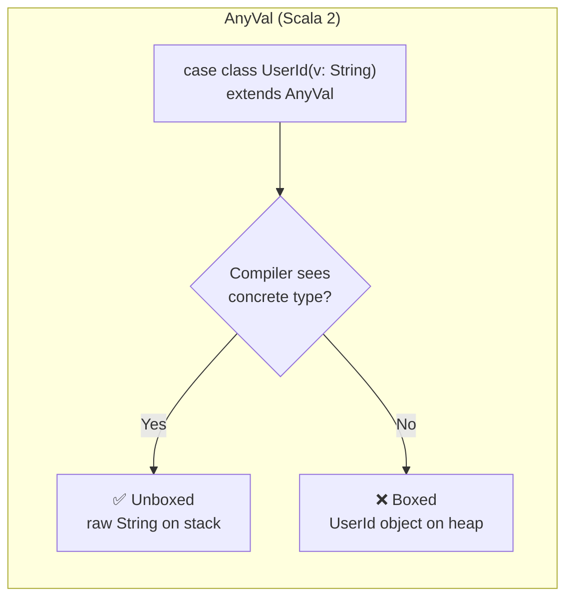
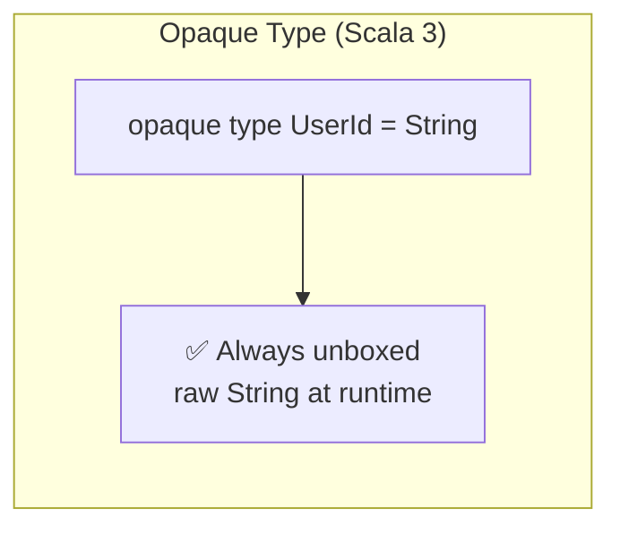

# Zero-Cost Type Class Derivation for Scala 3 Opaque Types

[日本語版](README.ja.md)

## What This Is

This project shows a pattern for **automatically deriving type class instances for opaque types** in Scala 3 — without writing a separate instance for each type, and with zero runtime overhead.

The pattern emerged from a real problem in a programmatic ad platform built with Pekko Cluster. The system defines dozens of opaque types — advertiser IDs, campaign IDs, creative IDs, site IDs, CPMs, budgets, spend tracking — all of which need `JsonFormat` instances for Spray JSON APIs, `Ordering` for sorted collections, and serialization support for Pekko cluster communication. Every opaque type carried the same mechanical wiring:

```scala
object CampaignId {
  opaque type CampaignId = String
  def apply(value: String): CampaignId = value              // wrap String → CampaignId
  extension (id: CampaignId) { def value: String = id }     // ① unwrap accessor
  given Ordering[CampaignId] = Ordering.String.on(_.value)   // ② hand-written Ordering
  given JsonFormat[CampaignId] with {                        // ③ hand-written JsonFormat
    def write(id: CampaignId) = JsString(id.value)           //   (8 lines of boilerplate)
    def read(json: JsValue) = json match {
      case JsString(s) => CampaignId(s)
      case other => deserializationError(s"Expected string, got $other")
    }
  }
}
```

The `.value` extension ① is the only way for outside code to recover the underlying `String`. Without it, neither `Ordering` ② nor `JsonFormat` ③ can be wired — every type class that needs access to the underlying value depends on this hand-written accessor, and every opaque type must provide one.

Multiply that across 15+ types, and each new type class you add (database column mappers, protobuf codecs, logging formatters) multiplies the per-type cost again. The implementations are identical every time — only the type name changes. Domain-specific logic like `CPM` arithmetic or `URL.domain` extraction is genuinely hand-written, but the `JsonFormat` and `Ordering` lines are pure boilerplate.

With the pattern described here, each companion shrinks to a single line of evidence export:

```scala
object CampaignId {
  opaque type CampaignId = String
  def apply(value: String): CampaignId = value
  given OpaqueCodec[CampaignId, String] = OpaqueCodec.fromEvidence  // replaces ①②③
}
```

Here's what each piece of boilerplate maps to:

| Before (hand-written per type) | After (derived from `OpaqueCodec`) |
|---|---|
| ① `extension (id: CampaignId) { def value: String = id }` | Not needed — ② and ③ only existed because they called `.value` to unwrap; the generic derivation rules use `codec.encode` internally instead |
| ② `given Ordering[CampaignId] = Ordering.String.on(_.value)` | Derived automatically via `OpaqueOrdering` |
| ③ `given JsonFormat[CampaignId] with { ... }` (8 lines) | Derived automatically via `OpaqueJsonSupport` |
| **Total: 11 lines of boilerplate per type** | **Total: 1 line of evidence per type** |

`.value` was the manual unwrap that ② and ③ depended on. With `OpaqueCodec`, the generic derivation rules use `codec.encode` to do the same unwrapping internally, so the per-type extension disappears entirely.

That one line replaces the `JsonFormat`, the `Ordering`, and any future type class instance — all derived automatically by the compiler from the exported `OpaqueCodec` instance. The domain-specific extensions stay where they belong: hand-written in the companion.

**What you'll learn in this guide:**

1. How opaque types work and their "inside vs. outside" visibility rule
2. The problem: why the compiler can't automatically reuse a codec for the underlying type
3. The solution: using type equality evidence (`=:=`) and `OpaqueCodec.fromEvidence` to derive instances generically
4. How to apply the pattern to real serialization libraries (Spray JSON as an example)
5. How to derive `Ordering` and other standard type classes with a single universal rule
6. How to handle validated types safely using `<:<` (subtype evidence)

## Background: Opaque Types in Scala 3

### Why zero-overhead types matter

Wrapping a value in an object just to give it a distinct type isn't free on the JVM. Each wrapper means an extra heap allocation, and in performance-sensitive code those small costs add up — especially when you're creating and discarding many short-lived wrappers.

Scala 2's `AnyVal` was designed to help. When you defined a class extending `AnyVal`, the compiler would try to represent instances using the underlying type at runtime, turning methods into static calls that operate on the unwrapped value. But this only held as long as the compiler could see the concrete `AnyVal` type. As soon as the value was seen through an abstract type, the wrapper object had to be allocated. You could never be sure whether a given use site was actually zero-cost or not.





Scala 3 introduced opaque types to provide a genuine zero-overhead guarantee. An opaque type exists only at compile time — at runtime it is always represented directly by its underlying type, with no wrapper, no allocation, and no boxing under any circumstances.

### What they look like

Scala 3's `opaque type` lets you create a brand-new type with zero runtime overhead:

```scala
object UserId {
  opaque type UserId = String

  def apply(value: String): UserId = value
}
```

This gives you two things at once:

- **Compile-time safety** — `UserId` and `String` are completely distinct types. You can't accidentally pass a `UserId` where an `OrderId` is expected, even though both are strings underneath.
- **Zero runtime cost** — at runtime, a `UserId` *is* just a `String`. There's no wrapper object, no extra allocation, no performance penalty.

### The Inside vs. Outside Rule

This is the single most important concept for understanding the rest of this guide.

An opaque type has two "faces" depending on where you look at it:

- **Inside the companion object** (where the opaque type is defined): the compiler knows that `UserId` is really `String`. You can freely assign a `String` to a `UserId` — for example, `def apply(value: String): UserId = value` compiles without any conversion.

- **Outside the companion object**: the compiler treats `UserId` as a completely separate type from `String`. It has no idea what the underlying type is. You cannot assign a `String` to a `UserId` or vice versa.

This boundary is what gives opaque types their safety — but it's also what creates the problem we're about to solve.

## The Problem: Type Classes Don't Cross the Boundary

### A concrete example of what goes wrong

Suppose you have a function that expects a `String`:

```scala
def greet(name: String): String = s"Hello, $name!"
```

If you try to call it with a `UserId`, the compiler refuses:

```scala
val uid = UserId("alice")
greet(uid)  // Compile error: Found UserId, Required: String
```

Outside the companion, `UserId` and `String` are different types. The compiler won't let you use one where the other is expected. That's the whole point of opaque types — but it creates a challenge when you need type class instances.

### The type class problem

Let's define a simple type class that represents bidirectional conversion between an opaque type and its underlying type:

```scala
trait OpaqueCodec[T, U] {
  def encode(t: T): U
  def decode(u: U): T
}
```

This `T ⇄ U` pattern shows up everywhere — JSON serialization, URL parameter encoding, database column mapping, and so on.

Even though `UserId` is `String` at runtime, the compiler treats them as unrelated types. So an `OpaqueCodec[String, String]` doesn't satisfy a requirement for `OpaqueCodec[UserId, String]`.

You *can* write the instance by hand inside the companion object, where the compiler knows the underlying type:

```scala
// Inside the companion, UserId = String is visible,
// so we can assign between them freely
given OpaqueCodec[UserId, String] with {
  def encode(t: UserId): String = t   // UserId → String works here
  def decode(s: String): UserId = s   // String → UserId works here
}
```

But repeating this for `OrderId`, `Email`, `SKU`, and every other opaque type means writing the same code over and over. The implementations are identical — only the type name changes.

If this feels like a lot of ceremony for what amounts to a no-op at runtime, that's because it is. Serializing a `UserId` is exactly the same operation as serializing a `String`, down to the last byte — no conversion, no transformation, no difference in behavior. The only one who doesn't know this is the compiler. When you wrote `opaque type UserId = String`, you told the compiler to treat them as different types — and it did exactly that. So now, even though a codec for `String` does precisely what a codec for `UserId` needs to do, the compiler won't let you use one where the other is expected. The derivation machinery in this guide exists entirely to bridge that gap: it's not teaching the compiler how to serialize `UserId` — it's reminding the compiler that it already knows how.

## The Key Insight: Type Equality Evidence (`=:=`)

The solution builds on a Scala feature called **type equality evidence**.

### What is `=:=`?

`=:=` (pronounced "is equal to") is a type defined in `scala.Predef`. An instance of `T =:= String` is a **proof object** — it's the compiler's way of saying "I can guarantee that `T` and `String` are the same type."

You can't create `=:=` instances yourself. Only the compiler can provide them, and only when the equality genuinely holds. When you write:

```scala
summon[UserId =:= String]
```

…the compiler either proves the types are equal and hands you the evidence, or refuses to compile.

### What can you do with `=:=` evidence?

Once you have an evidence value `ev: T =:= String`, it doubles as a conversion function:

```scala
ev(t)        // converts T → String
ev.flip(s)   // converts String → T
```

These conversions are identity operations at runtime — they exist only to satisfy the type system. No actual data transformation happens.

### How `=:=` interacts with opaque types

This is where the inside/outside rule comes back:

- **Inside the companion object**: the compiler knows `UserId = String`, so it can provide `UserId =:= String` evidence. `summon[UserId =:= String]` succeeds.
- **Outside the companion object**: the compiler sees `UserId` as opaque — it doesn't know the underlying type. `summon[UserId =:= String]` fails to compile.

```scala
object UserId {
  opaque type UserId = String

  // Inside: the compiler knows UserId = String
  val evidence = summon[UserId =:= String]  // ✓ compiles
}

// Outside: the compiler doesn't know what UserId is
val evidence = summon[UserId =:= String]    // ✗ compile error
```

So the `=:=` is only available inside the companion. The solution: consume it there via `OpaqueCodec.fromEvidence` to produce a concrete instance, and export that instead.

## The Solution: `OpaqueCodec.fromEvidence` + Concrete Export

### Step 1: The generic derivation rule

We define a derivation rule in `OpaqueCodec`'s companion object that works for *any* type the compiler can prove is equal to another:

```scala
trait OpaqueCodec[T, U] {
  def encode(t: T): U
  def decode(u: U): T
}

object OpaqueCodec {

  // Factory method: given conversion functions, build an OpaqueCodec
  private def fromConversion[T, U](
    to: T => U,
    from: U => T
  ): OpaqueCodec[T, U] =
    new OpaqueCodec[T, U] {
      def encode(t: T): U = to(t)
      def decode(u: U): T = from(u)
    }

  // Consume =:= evidence and produce a concrete OpaqueCodec.
  // Called from inside companion objects where =:= is available.
  inline def fromEvidence[T, U](using inline ev: T =:= U): OpaqueCodec[T, U] =
    fromConversion(ev(_), ev.flip(_))

  // For any type T that the compiler can prove equals U,
  // automatically create an OpaqueCodec[T, U]
  inline given derived[T, U](using inline ev: T =:= U): OpaqueCodec[T, U] =
    fromConversion(ev(_), ev.flip(_))
}
```

Let's break down the key methods:

- **`fromEvidence`** — a non-given `inline def` that companion objects call to produce a concrete `OpaqueCodec` from the `=:=` evidence available inside the companion. This is the primary way domain types export their codec.
- **`derived`** — a `given` that the compiler can use when `=:=` evidence is already in implicit scope (e.g., for `OpaqueCodec[String, String]` via `<:<.refl`).

Let's break down the `derived` method in detail:

- **`inline given derived[T, U]`** — this is a generic given (sometimes called a "blanket given"): it can produce an `OpaqueCodec` for *any* pair of types `T` and `U`. The `inline` keyword tells the compiler to resolve everything at compile time and expand the body inline, so nothing remains at runtime.
- **`(using inline ev: T =:= U)`** — this constrains which type pairs qualify. The compiler will only use this rule when it can prove `T =:= U`. Only types that are genuinely equal — including opaque types defined as their underlying type — will match.
- **`fromConversion(ev(_), ev.flip(_))`** — uses the evidence as conversion functions. `ev(_)` converts `T → U` for encoding, and `ev.flip(_)` converts `U → T` for decoding.

Because everything is `inline`, the `=:=` conversions (which are identity casts) are erased entirely at compile time. The generated code has no conversion overhead, no allocation, no evidence object — just direct operations on the underlying type.

### Step 2: Exporting a concrete `OpaqueCodec`

The compiler can only prove `UserId =:= String` *inside* the companion. Rather than leaking raw `=:=` evidence (which causes problems — see the Ordering section below), we consume it inside the companion and export a concrete `OpaqueCodec` instance:

```scala
object UserId {
  opaque type UserId = String

  def apply(value: String): UserId = value

  // Consume the =:= evidence (available here, inside the companion)
  // and export a concrete OpaqueCodec[UserId, String] instance.
  given OpaqueCodec[UserId, String] = OpaqueCodec.fromEvidence
}
```

Here's what happens:

1. Inside this companion, the compiler knows `UserId = String`, so `fromEvidence` can summon `UserId =:= String`
2. `fromEvidence` uses the evidence to build a concrete `OpaqueCodec[UserId, String]`
3. The `given` declaration exports that concrete instance — not the raw `=:=` — so it's available outside the companion

The `=:=` is never leaked. External code sees only `OpaqueCodec[UserId, String]` — a two-type-parameter instance that the compiler can resolve without ambiguity (see the Ordering section for why this matters).

This is a significant win over writing codec instances by hand. You write **one line** per opaque type, and you get derivation for *every* type class that takes `OpaqueCodec` — JSON formats, `Ordering`, database column mappers, and anything else you build this way.

## What the Compiler Does: Step by Step

When you write:

```scala
summon[OpaqueCodec[UserId, String]]
```

…here's what happens behind the scenes:

1. **Search** — the compiler looks for an `OpaqueCodec[UserId, String]` in implicit scope
2. **Find** — it finds the concrete `given OpaqueCodec[UserId, String]` exported from `UserId`'s companion object (produced by `fromEvidence`)
3. **Done** — no further resolution needed. The instance is concrete, not derived through `=:=` at the call site

Because `fromEvidence` is `inline`, the `=:=` conversions (which are identity functions) are erased at compile time. The generated code has zero runtime overhead.

The result: you get an `OpaqueCodec[UserId, String]` that is type-safe at compile time and free at runtime.

## Verification

With both pieces in place, the following resolves automatically from any call site:

```scala
summon[OpaqueCodec[String, String]]      // identity codec (trivial)
summon[OpaqueCodec[UserId, String]]      // derived via =:= evidence
summon[OpaqueCodec[Timestamp, Long]]     // works for any underlying type
summon[OpaqueCodec[BidPrice, BigDecimal]] // BigDecimal-based, same pattern
```

## Scaling Up: Multiple Opaque Types

The pattern scales cleanly. Each new opaque type needs only the `OpaqueCodec` export:

```scala
object OrderId {
  opaque type OrderId = String
  def apply(value: String): OrderId = value
  given OpaqueCodec[OrderId, String] = OpaqueCodec.fromEvidence
}

object Email {
  opaque type Email = String
  def apply(value: String): Email = value
  given OpaqueCodec[Email, String] = OpaqueCodec.fromEvidence
}

object Timestamp {
  opaque type Timestamp = Long
  def apply(value: Long): Timestamp = value
  given OpaqueCodec[Timestamp, Long] = OpaqueCodec.fromEvidence
}

object BidPrice {
  opaque type BidPrice = BigDecimal
  def apply(value: BigDecimal): BidPrice = value
  given OpaqueCodec[BidPrice, BigDecimal] = OpaqueCodec.fromEvidence
}
```

All of these types — `String`-based, `Long`-based, `BigDecimal`-based — get `OpaqueCodec` instances, `Ordering`, JSON formats, and any future type class with no per-type boilerplate beyond this one line.

## Practical Example: Spray JSON Integration

Here's how `OpaqueCodec` composes with a real serialization library. The following derives a Spray JSON `JsonFormat` from any available `OpaqueCodec`:

```scala
object OpaqueJsonSupport extends LowPriorityOpaqueJsonSupport {

  // Any type with an OpaqueCodec[T, String] gets a JsonFormat automatically
  given opaqueStringJsonFormat[T](using codec: OpaqueCodec[T, String]): JsonFormat[T] with {
    def write(t: T) = JsString(codec.encode(t))
    def read(json: JsValue): T = json match {
      case JsString(s) => codec.decode(s)
      case other => deserializationError(s"Expected JSON string, got $other")
    }
  }

  // Same for Long-backed types
  given opaqueLongJsonFormat[T](using codec: OpaqueCodec[T, Long]): JsonFormat[T] with {
    def write(t: T) = JsNumber(codec.encode(t))
    def read(json: JsValue): T = json match {
      case JsNumber(n) => codec.decode(n.toLongExact)
      case other => deserializationError(s"Expected JSON number, got $other")
    }
  }

  // Same for BigDecimal-backed types
  given opaqueBigDecimalJsonFormat[T](using codec: OpaqueCodec[T, BigDecimal]): JsonFormat[T] with {
    def write(t: T) = JsNumber(codec.encode(t))
    def read(json: JsValue): T = json match {
      case JsNumber(n) => codec.decode(n)
      case other => deserializationError(s"Expected JSON number, got $other")
    }
  }
}
```

Because `OpaqueCodec[UserId, String]` is derived automatically, `opaqueStringJsonFormat[UserId]` resolves with no additional wiring. The same applies to `Timestamp` (via `Long`), `BidPrice` (via `BigDecimal`), and every other opaque type that exports its evidence.

## Beyond Codecs: Deriving Ordering

The `=:=` pattern isn't limited to serialization. Any type class that exists for the underlying type can be derived for the opaque type the same way. `Ordering` is a natural example — in a codebase with many opaque identifier types, you'd otherwise write `given Ordering[CampaignId] = Ordering.String.on(_.value)` for each one.

### The naive approach with raw `=:=` and why it doesn't work

If companions exported raw `=:=` evidence (i.e., `given UserId =:= String = summon`), you might expect a single generic rule to cover all cases:

```scala
// ✗ Does not compile — ambiguous =:= evidence
object OpaqueOrdering {
  inline given derived[T, U](using inline ev: T =:= U, ord: Ordering[U]): Ordering[T] =
    ord.on(ev(_))
}
```

This fails because Scala 3's `<:<.refl` provides `T =:= T` for any type. When the compiler searches for `UserId =:= U` with `U` unconstrained, it finds two candidates: `<:<.refl` (giving `U = UserId`) and the exported evidence (giving `U = String`). Neither is more specific, so the compiler reports an ambiguity.

This wasn't a problem for `OpaqueCodec.derived` because the call sites always specify both type parameters — `summon[OpaqueCodec[UserId, String]]` — leaving nothing to infer. But `List[UserId].sorted` only tells the compiler it needs `Ordering[UserId]`; the underlying type must be discovered, and that's where the ambiguity arises.

### ~~The fix: pin the underlying type~~

~~The solution is to provide a derivation rule per underlying type. When `U` is fixed to `String`, the only `=:= String` evidence the compiler finds is the one exported from the companion — `<:<.refl[UserId]` gives `UserId =:= UserId`, which doesn't match `T =:= String`:~~

```scala
// ✗ Previously required — one rule per underlying type
object OpaqueOrdering {

  private def fromEvidence[T, U](to: T => U, ord: Ordering[U]): Ordering[T] =
    ord.on(to)

  inline given derivedString[T](using inline ev: T =:= String, ord: Ordering[String]): Ordering[T] =
    fromEvidence(ev(_), ord)

  inline given derivedLong[T](using inline ev: T =:= Long, ord: Ordering[Long]): Ordering[T] =
    fromEvidence(ev(_), ord)

  inline given derivedDouble[T](using inline ev: T =:= Double, ord: Ordering[Double]): Ordering[T] =
    fromEvidence(ev(_), ord)

  inline given derivedBigDecimal[T](using inline ev: T =:= BigDecimal, ord: Ordering[BigDecimal]): Ordering[T] =
    fromEvidence(ev(_), ord)
}
```

~~This is less elegant than a single rule, but it's still a single import that replaces every hand-written `Ordering` instance.~~

### The real fix: export concrete `OpaqueCodec` instead of raw `=:=`

The pinning approach above is no longer needed. By having each companion export a concrete `OpaqueCodec[T, U]` instead of raw `=:=` evidence, the ambiguity disappears entirely. `OpaqueOrdering` becomes a single universal rule:

```scala
object OpaqueOrdering {
  given derived[T, U](using codec: OpaqueCodec[T, U], ord: Ordering[U]): Ordering[T] =
    ord.asInstanceOf[Ordering[T]]
}
```

This works because `OpaqueCodec[UserId, U]` can only resolve to the concrete `OpaqueCodec[UserId, String]` exported from the companion — the compiler infers `U = String` directly. There's no `<:<.refl` in play because `OpaqueCodec` is an unrelated trait, not part of the `=:=`/`<:<` hierarchy.

The `asInstanceOf` cast is safe here: `OpaqueCodec[T, U]` is constructed from `T =:= U` evidence inside the companion, which guarantees `T` and `U` erase to the same JVM type. `Ordering[U]` already IS `Ordering[T]` at runtime — no wrapping or delegation needed.

The same single import still works:

```scala
import codec.OpaqueOrdering.given

val ids = List(UserId("charlie"), UserId("alice"), UserId("bob"))
ids.sorted  // List(alice, bob, charlie) — Ordering[UserId] derived automatically
```

Adding a new underlying type requires no changes to `OpaqueOrdering` — the single rule covers it automatically, as long as the underlying type has an `Ordering` instance.

### Practical tip: use `String` as the underlying type for IDs

When you need a sortable unique identifier — such as a ULID-based trace ID — store it as a plain `String`:

```scala
object TraceId {
  opaque type TraceId = String
  def apply(value: String): TraceId = value
  def newTraceId: TraceId = ULID.newULIDString   // generate, store as String
  given OpaqueCodec[TraceId, String] = OpaqueCodec.fromEvidence
}
```

A ULID is a 128-bit value (48-bit timestamp + 80-bit random) encoded as a 26-character Crockford Base32 string. The encoding is designed so that lexicographic string comparison equals chronological order — which means `Ordering[String]` gives you time-based sorting for free via `OpaqueOrdering`. No special `Ordering` instance, no wrapper objects, no extra library needed. This project includes a minimal `ULID.newULIDString` generator (see `patterns/ulid/ULID.scala`) that produces monotonically increasing strings within the same millisecond.

## Beyond Ordering: Deriving Numeric

The same pattern extends to `Numeric` — a type class that provides arithmetic operations. In a codebase with numeric opaque types like `BidPrice` or `Timestamp`, you'd otherwise write `Numeric[BidPrice]` instances by hand, delegating each operation to `BigDecimal`.

### OpaqueNumeric: a single universal rule

```scala
object OpaqueNumeric {
  given derived[T, U](using codec: OpaqueCodec[T, U], num: Numeric[U]): Numeric[T] =
    num.asInstanceOf[Numeric[T]]
}
```

The same `asInstanceOf` technique as `OpaqueOrdering` — since `T` and `U` erase to the same JVM type, `Numeric[U]` is reused directly with zero overhead.

`OpaqueNumeric` also provides operator extension methods (`+`, `-`, `*`, unary `-`) so you can write natural arithmetic expressions. Import with `{given, *}` to get both the `Numeric` instance and the operators:

```scala
import codec.OpaqueNumeric.{given, *}
```

Because `Numeric` extends `Ordering`, this also provides ordering. For numeric opaque types, use `OpaqueNumeric` instead of `OpaqueOrdering` to avoid ambiguous implicits.

### Inches and Centimeters: extension methods + arithmetic

A classic example from *Advanced Programming in Scala, 5th Edition* — unit-safe length types:

```scala
object Inches {
  opaque type Inches = Double
  def apply(value: Double): Inches = value
  given OpaqueCodec[Inches, Double] = OpaqueCodec.fromEvidence

  extension (i: Inches) {
    def toCentimeters: Centimeters.Centimeters = Centimeters(i * 2.54)
    def value: Double = i
  }
}

object Centimeters {
  opaque type Centimeters = Double
  def apply(value: Double): Centimeters = value
  given OpaqueCodec[Centimeters, Double] = OpaqueCodec.fromEvidence

  extension (c: Centimeters) {
    def toInches: Inches.Inches = Inches(c / 2.54)
    def value: Double = c
  }
}
```

The extension methods add domain-specific conversion logic. `OpaqueNumeric` adds arithmetic automatically. The type system prevents mixing units — `Inches + Centimeters` won't compile:

```scala
import codec.OpaqueNumeric.{given, *}

Inches(1.0) + Inches(2.0)       // ✓ Inches(3.0)
Inches(5.0) - Inches(2.0)       // ✓ Inches(3.0)
-Inches(3.0)                     // ✓ Inches(-3.0)
List(Inches(1), Inches(2)).sum   // ✓ Inches(3.0)
Inches(1.0) + Centimeters(2.0)  // ✗ compile error — type mismatch
```

### Why `asInstanceOf` and not delegation?

A naive approach wraps every `Numeric` operation through `codec.encode`/`codec.decode`:

```scala
// ✗ ~2x slower — 4 virtual dispatches per encode/decode
def plus(x: T, y: T): T = codec.decode(num.plus(codec.encode(x), codec.encode(y)))
```

Each `codec.encode(x)` traverses: `OpaqueCodec` vtable → `Function1` vtable → `=:=` vtable → identity. That's 4 levels of virtual dispatch for what is ultimately a no-op. JMH benchmarks confirm the overhead:

```
Benchmark                         Mode  Cnt  Score    Error   Units
NumericBenchmark.raw_compare     thrpt    5   0.710 ±  0.064  ops/ns   ← Numeric[BigDecimal] directly
NumericBenchmark.codec_compare   thrpt    5   0.287 ±  0.007  ops/ns   ← delegation via codec.encode/decode
NumericBenchmark.cast_compare    thrpt    5   0.713 ±  0.054  ops/ns   ← asInstanceOf (zero overhead)
```

The `asInstanceOf` approach reuses the existing `Numeric[U]` instance directly — no wrapping, no delegation, no virtual dispatch overhead. This is safe because `OpaqueCodec[T, U]` can only be constructed from `T =:= U` evidence, which guarantees `T` and `U` erase to the same JVM type.

## Pattern: Interface Narrowing via Opaque Types (IArray)

Opaque types can restrict an existing mutable API to a read-only view — the same technique Scala's standard library uses for `IArray`.

### The idea

`ArrayBuffer` is mutable. By aliasing it behind an opaque type boundary and only exposing read-only extension methods, we get an immutable interface with zero wrapping overhead:

```scala
object ImmutableBuffer {
  opaque type ImmutableBuffer[+T] = ArrayBuffer[? <: T]

  def apply[T](elems: T*): ImmutableBuffer[T] = ArrayBuffer.from(elems)
  def unsafeFromArrayBuffer[T](buf: ArrayBuffer[T]): ImmutableBuffer[T] = buf

  extension [T](buf: ImmutableBuffer[T]) {
    def apply(index: Int): T = buf(index)
    def size: Int = buf.size
    def head: T = buf.head
    def last: T = buf.last
    def toList: List[T] = buf.toList
    def map[U](f: T => U): ImmutableBuffer[U] = ArrayBuffer.from(buf.map(f))
    def filter(p: T => Boolean): ImmutableBuffer[T] = ArrayBuffer.from(buf.filter(p))
    // No add/remove/update — hidden by the opaque boundary
  }
}
```

### Key techniques

**Covariance on an invariant backing type.** `ArrayBuffer` is invariant (`ArrayBuffer[T]`), but the opaque type declares `ImmutableBuffer[+T]` using the wildcard `ArrayBuffer[? <: T]`. This mirrors `IArray`:

```
opaque type IArray[+T] = Array[? <: T]           // stdlib
opaque type ImmutableBuffer[+T] = ArrayBuffer[? <: T]  // our version
```

The covariance is safe because the opaque boundary hides all mutation methods — you can only read, not write.

**`unsafeFromArrayBuffer` as an explicit escape hatch.** Like `IArray.unsafeFromArray`, this shares the backing storage without copying. Mutations through the original reference are visible — hence "unsafe":

```scala
val backing = ArrayBuffer(1, 2, 3)
val buf = ImmutableBuffer.unsafeFromArrayBuffer(backing)
backing(0) = 99
buf(0)  // 99 — the mutation is visible
```

## Pitfall: Matchable and Runtime Safety

Opaque types are a compile-time concept. At runtime, they're fully erased to their underlying type. This creates pitfalls when you use runtime type checks.

### The problem

Consider two opaque types backed by `String`:

```scala
object Street {
  opaque type Street = String
  def apply(value: String): Street = value
}

object City {
  opaque type City = String
  def apply(value: String): City = value
}
```

At compile time, `Street` and `City` are distinct types. At runtime, both are `String`:

```scala
val street: Street = Street("123 Main St")

street.isInstanceOf[String]  // true — opaque type is erased

(street: Any) match {
  case s: String => "matched as String"  // this branch executes
  case _         => "not matched"
}
```

### What doesn't work at runtime

- **`isInstanceOf`** always sees the underlying type — it cannot distinguish `Street` from `City`
- **Pattern matching** on type pierces the opaque boundary
- **`ClassTag`** for `Street` and `String` share the same `runtimeClass`
- **`asInstanceOf`** can cast between opaque types sharing the same underlying type

### Mitigation: `strictEquality`

With universal equality (the default), `Street("x") == City("x")` returns `true` at runtime — the opaque type distinction is invisible. Enabling `strictEquality` prevents this:

```scala
import scala.language.strictEquality

Street("x") == City("x")  // ✗ compile error without CanEqual instance
```

### Takeaway

Opaque types provide **compile-time** safety only. Never rely on runtime type checks (`isInstanceOf`, pattern matching on type, `ClassTag`) to distinguish opaque types. Use the type system — not runtime reflection — to enforce boundaries.

## Opaque Types in the Scala Standard Library

The patterns demonstrated in this project aren't academic exercises — they appear in Scala's own standard library. Examining the stdlib source reveals three notable uses.

### `IArray`: read-only arrays via covariance trick

From `scala.IArray`:

```scala
opaque type IArray[+T] = Array[? <: T]
```

`Array` is invariant and mutable. By wrapping it in an opaque type with a covariant type parameter and a wildcard lower bound, the stdlib creates a read-only array that supports subtype assignment:

```scala
val strings: IArray[String] = IArray("hello", "world")
val anys: IArray[Any] = strings   // ✓ covariance allows this
anys(0)                            // "hello"
```

The opaque boundary hides `Array`'s `update` method. Extension methods like `apply`, `length`, `map`, and `filter` define the public API. `IArray.unsafeFromArray` provides a zero-copy escape hatch for performance-critical code.

Our `ImmutableBuffer` example follows this exact pattern with `ArrayBuffer` as the backing type.

### `NamedTuple`: compile-time-only field names

From `scala.NamedTuple`:

```scala
opaque type NamedTuple[N <: Tuple, +V <: Tuple] = V
```

A named tuple is just a plain tuple (`V`) at runtime. The names (`N`) exist only as a type-level parameter — they're erased completely:

```scala
val person = (name = "Alice", age = 30)
person.name     // "Alice" — field access via extension method
person.toTuple  // ("Alice", 30) — strips the names
```

This demonstrates the "phantom information" pattern: using opaque types to carry compile-time metadata that costs nothing at runtime.

### `Conversion.into`: subtype-widening marker

From `scala.Conversion`:

```scala
opaque type into[+T] >: T = T
```

This declares that `into[T]` is a supertype of `T` (`>: T`) while being equal to `T` at runtime. It's used to mark values that can be implicitly converted — the opaque type acts as a type-level flag that triggers conversion lookup without any runtime representation.

## Limitations

There are a few boundaries to be aware of.

### Opaque types only

This approach applies to **opaque types only**. Wrapper classes like `case class UserId(value: String)` don't produce `=:=` evidence and aren't covered. For wrapper classes, you're better served by deriving through the constructor and extractor directly.

### One line per opaque type

Each opaque type's companion must export its `=:=` evidence with an explicit `given`. This is a single line per type, but it *is* a line you have to remember to write. Forgetting it will produce a "no given instance found" error at the call site — the fix is straightforward once you know the pattern.

### Encapsulation tradeoff with `=:=`

**For most opaque types, this isn't a concern.** The typical opaque type is a simple type tag with no invariants — it exists for compile-time safety (don't mix `UserId` with `OrderId`), not to enforce constraints. The pattern works perfectly for this common case.

However, if your opaque type has **validation logic**, exporting `=:=` evidence creates a way to bypass it. Consider:

```scala
object Email {
  opaque type Email = String

  def apply(value: String): Either[String, Email] =
    if value.contains("@") then Right(value)
    else Left(s"Invalid email: $value")

  given Email =:= String = summon  // ← this opens a backdoor
}
```
ld
The `apply` method enforces that every `Email` contains `@`. But the exported evidence provides a way around that:

```scala
import Email.given

val ev = summon[Email =:= String]
val bad: Email = ev.flip("not-an-email")  // bypasses validation entirely
```

This `Email` value was never checked by `apply` — it violates the invariant. The next section shows how to solve this using `<:<` instead.

## The `<:<` Approach: Safe Encoding for Validated Types

### The problem with `=:=` for validated types

As shown above, exporting `=:=` evidence gives you bidirectional conversion — anyone can go from `String` to your opaque type, bypassing any validation. For simple type tags that's fine, but for validated types you need a different approach.

### How `<:<` differs from `=:=`

`<:<` proves a **subtype** relationship (`A <: B`) rather than type **equality** (`A = B`). The key differences:

- `=:=` gives you bidirectional conversion: `ev(t)` for `T → String` and `ev.flip(s)` for `String → T`
- `<:<` gives you one-way conversion only: `ev(t)` for `T → String`. There is no `flip`.

More importantly, if you declare an opaque type with an **upper bound**, the `<:<` evidence is available outside the companion **automatically** — no export needed:

```scala
object ValidatedEmail {
  opaque type ValidatedEmail <: String = String
  //                        ^^^^^^^^^^
  //  This upper bound makes ValidatedEmail <:< String
  //  available to external code automatically.
}
```

### Splitting encode and decode

This one-way nature of `<:<` maps perfectly onto a split between encoding (always safe) and decoding (needs validation):

```scala
// Encode: T → String (automatic via <:<, no evidence export needed)
trait StringEncoder[T] {
  def encode(t: T): String
}

object StringEncoder {
  private def fromConversion[T](to: T => String): StringEncoder[T] =
    (t: T) => to(t)

  inline given derived[T](using inline ev: T <:< String): StringEncoder[T] =
    fromConversion(ev(_))
}

// Decode: String → T (must go through the smart constructor)
trait StringDecoder[T] {
  def decode(s: String): Either[String, T]
}

object StringDecoder {
  private def fromConversion[T](from: String => T): StringDecoder[T] =
    (s: String) => Right(from(s))

  inline given derived[T](using inline ev: T =:= String): StringDecoder[T] =
    fromConversion(ev.flip(_))
}
```

The `StringEncoder` derives automatically for any type with `<:< String` — including both `=:=` types (since `=:=` extends `<:<`) and upper-bounded types. The `StringDecoder` returns `Either`, giving the implementation a chance to reject invalid input.

### Using it with a validated opaque type

```scala
object ValidatedEmail {
  opaque type ValidatedEmail <: String = String

  def apply(value: String): Either[String, ValidatedEmail] =
    if value.contains("@") then Right(value)
    else Left(s"Invalid email: $value")

  // No =:= export — no backdoor.
  // Encoding works automatically via <:< from the upper bound.
  // Decoding goes through the smart constructor to enforce validation.
  given StringDecoder[ValidatedEmail] with {
    def decode(s: String): Either[String, ValidatedEmail] = apply(s)
  }
}
```

From external code:

```scala
// Encoding: resolves automatically, no export needed
val encoder = summon[StringEncoder[ValidatedEmail]]
encoder.encode(ve)  // "alice@example.com"

// Decoding: uses the hand-written instance, enforces validation
val decoder = summon[StringDecoder[ValidatedEmail]]
decoder.decode("alice@example.com")  // Right(alice@example.com)
decoder.decode("not-an-email")       // Left(Invalid email: not-an-email)

// No backdoor — this won't compile:
summon[ValidatedEmail =:= String]    // ✗ compile error
```

### Spray JSON integration with priority

The `StringEncoder` + `StringDecoder` pair composes into a `JsonFormat` the same way `OpaqueCodec` does. To avoid ambiguity for types that have both `OpaqueCodec` (via `=:=`) and `StringEncoder` + `StringDecoder` (via `<:<`), we use Scala's given priority mechanism — the `OpaqueCodec`-based format takes precedence, and the encoder/decoder pair acts as a fallback for validated types:

```scala
object OpaqueJsonSupport extends LowPriorityOpaqueJsonSupport {
  // Higher priority: bidirectional codec (=:= types)
  given opaqueStringJsonFormat[T](using codec: OpaqueCodec[T, String]): JsonFormat[T] with {
    def write(t: T) = JsString(codec.encode(t))
    def read(json: JsValue): T = json match {
      case JsString(s) => codec.decode(s)
      case other => deserializationError(s"Expected JSON string, got $other")
    }
  }
}

trait LowPriorityOpaqueJsonSupport {
  // Lower priority: encoder + decoder pair (<:< types with validation)
  given validatedStringJsonFormat[T](using
    encoder: StringEncoder[T],
    decoder: StringDecoder[T]
  ): JsonFormat[T] with {
    def write(t: T) = JsString(encoder.encode(t))
    def read(json: JsValue): T = json match {
      case JsString(s) =>
        decoder.decode(s) match {
          case Right(t) => t
          case Left(err) => deserializationError(err)
        }
      case other => deserializationError(s"Expected JSON string, got $other")
    }
  }
}
```

This means `ValidatedEmail` gets a `JsonFormat` that serializes freely but **rejects invalid values on deserialization** — exactly what you want.

### When to use which

| Approach | Evidence | Export needed? | Encode | Decode | Validation safe? |
|----------|----------|---------------|--------|--------|-----------------|
| `=:=` | Type equality | Yes (1 line per type) | Automatic | Automatic | No |
| `<:<` | Upper bound | No | Automatic | Hand-written | Yes |

**Rule of thumb:** if your opaque type has no validation (just a type tag), use `=:=` for maximum convenience. If it enforces invariants, use an upper bound with `<:<` for encoding and a hand-written `StringDecoder` for decoding.

## Bytecode Analysis: Verifying the Zero-Cost Claim

The claim that opaque types are "zero-cost" is central to this approach. Here's what `javap` reveals about the compiled output.

### The opaque type is fully erased

`UserId.apply` compiles to a method that takes a `String` and returns a `String` — no wrapper class exists:

```
public java.lang.String apply(java.lang.String);
    Code:
       0: aload_1
       1: areturn
```

One instruction: load the argument, return it. There is no `UserId` class at bytecode level. The JVM sees only `java.lang.String`.

### The `=:=` evidence is a singleton, not per-use allocation

The exported `given UserId =:= String` compiles to a lazy field that holds a reference to the global `=:=` singleton:

```
public final scala.$eq$colon$eq<java.lang.String, java.lang.String>
    given_$eq$colon$eq_UserId_String();
```

Note the type parameters are `<String, String>` — the opaque type has been erased. The evidence is initialized once (lazily, thread-safe) and reused for every codec derivation that needs it. There is no per-use allocation.

### At the call site: inline expansion

When you write `summon[OpaqueCodec[UserId, String]]`, the `inline given derived` expands at compile time. The resulting bytecode at the call site looks like this:

```
// Create the two conversion lambdas
invokedynamic  // ev(_)      → UserId → String
invokedynamic  // ev.flip(_) → String → UserId

// Build the codec
invokevirtual  OpaqueCodec$.inline$fromConversion(Function1, Function1)
```

The `ev(_)` lambda internally fetches the singleton evidence and calls `.apply()`, which is an identity function:

```
getstatic   domain/UserId$.MODULE$
invokevirtual  given_$eq$colon$eq_UserId_String  // fetch singleton
invokevirtual  scala/$eq$colon$eq.apply           // identity: returns arg unchanged
```

### What the JIT does with this

At bytecode level, the `=:=` evidence is referenced but never allocated per use — it's a singleton. The `.apply()` call on that singleton is a trivial identity function (`return x`). After JIT warmup, the JIT compiler will:

1. Inline the evidence access (it's a constant singleton)
2. Inline the `.apply()` identity call
3. Eliminate the entire chain, leaving just the raw value pass-through

### Benchmark confirmation

A JMH benchmark comparing two different opaque types (`UserId` and `OrderId`), both derived through the same `=:=` + `fromConversion` mechanism, confirms identical throughput:

```
Benchmark                                Score   Error   Units
CodecBenchmark.opaque_encodeUserId      0.641 ± 0.056  ops/ns
CodecBenchmark.opaque_encodeOrderId     0.636 ± 0.127  ops/ns
CodecBenchmark.opaque_decodeUserId      0.644 ± 0.070  ops/ns
CodecBenchmark.opaque_decodeOrderId     0.640 ± 0.074  ops/ns
CodecBenchmark.opaque_roundtripUserId   0.454 ± 0.037  ops/ns
CodecBenchmark.opaque_roundtripOrderId  0.455 ± 0.004  ops/ns
```

The confidence intervals overlap completely — the opaque type itself adds zero measurable overhead. The absolute cost visible here is from `Function1` virtual dispatch in the codec pattern, which is the same regardless of which opaque type is used.

To reproduce: `sbt 'Jmh/run benchmark.CodecBenchmark'`

## Performance: When `asInstanceOf` Matters and When It Doesn't

The `OpaqueCodec` trait provides `encode`/`decode` as virtual methods. For opaque types these are identity functions, but calling them still involves virtual dispatch: `OpaqueCodec` vtable → `Function1` vtable → `=:=` vtable → identity. That's 4 levels of indirection per call.

Whether this matters depends on what the surrounding operation costs.

### Cheap operations: overhead is visible

For type classes where the core operation is fast — like `Ordering.compare` (a few nanoseconds) — the dispatch overhead is proportionally large. JMH benchmarks show ~2.5x slowdown with delegation vs direct use:

```
Benchmark                         Mode  Cnt  Score    Error   Units
NumericBenchmark.raw_compare     thrpt    5   0.710 ±  0.064  ops/ns   ← Numeric[BigDecimal] directly
NumericBenchmark.codec_compare   thrpt    5   0.287 ±  0.007  ops/ns   ← delegation via codec.encode/decode
NumericBenchmark.cast_compare    thrpt    5   0.713 ±  0.054  ops/ns   ← asInstanceOf (zero overhead)
```

For `OpaqueOrdering` and `OpaqueNumeric`, the fix is to reuse the underlying type class instance directly via `asInstanceOf`:

```scala
given derived[T, U](using codec: OpaqueCodec[T, U], ord: Ordering[U]): Ordering[T] =
  ord.asInstanceOf[Ordering[T]]
```

This is safe because `OpaqueCodec[T, U]` can only be constructed from `T =:= U` evidence, which guarantees `T` and `U` erase to the same JVM type. The cast is a JVM no-op — `Ordering[U]` already IS `Ordering[T]` at runtime.

### Expensive operations: overhead disappears

For type classes where each operation involves object allocation — like `JsonFormat` where `write` creates `JsString`/`JsNumber` objects and `read` performs pattern matching — the dispatch overhead is negligible:

```
Benchmark                        Mode  Cnt  Score   Error   Units
JsonBenchmark.raw_write         thrpt    5   0.440 ± 0.030  ops/ns   ← JsonFormat[String] directly
JsonBenchmark.opaque_write      thrpt    5   0.443 ± 0.019  ops/ns   ← via codec.encode/decode
JsonBenchmark.raw_read          thrpt    5   0.878 ± 0.083  ops/ns
JsonBenchmark.opaque_read       thrpt    5   0.808 ± 0.028  ops/ns
```

The `JsString` allocation (~2ns) dwarfs the codec dispatch overhead. The JIT successfully inlines the identity calls when the surrounding operation provides enough "thermal mass." No optimization needed for `OpaqueJsonSupport`.

### Rule of thumb

| Type class pattern | Core operation cost | Codec overhead visible? | Use `asInstanceOf`? |
|---|---|---|---|
| `Ordering` / `Numeric` | A few ns (comparison, arithmetic) | Yes (~2.5x) | Yes |
| `JsonFormat` | Tens of ns (allocation, matching) | No (~1x) | Not needed |

The general principle: if the underlying operation is cheap enough that a few nanoseconds of virtual dispatch matters, reuse the instance via `asInstanceOf`. If the operation involves allocation or I/O, the codec dispatch vanishes in the noise.

To reproduce: `sbt 'Jmh/run benchmark.NumericBenchmark'`

## Conclusion

By combining Scala 3's `opaque type`, type equality evidence (`=:=`), and `OpaqueCodec.fromEvidence`, you get type class derivation that is type-safe, zero-cost, and nearly boilerplate-free. The generalized `OpaqueCodec[T, U]` handles any underlying type — `String`, `Long`, `BigDecimal`, or anything else. Because each companion exports a concrete `OpaqueCodec` instance (not raw `=:=`), library integrations like `OpaqueOrdering` can use a single universal `[T, U]` rule — no per-underlying-type pinning needed.

For validated types, the subtype evidence (`<:<`) provided by an upper bound gives you automatic encoding without opening a backdoor to bypass validation. Decoding goes through a hand-written instance that enforces your constraints.

Bytecode inspection confirms that opaque types are fully erased at runtime, the `=:=` evidence is a singleton (not a per-use allocation), and the JIT compiler can reduce the entire derivation chain to a no-op pass-through.

If your project makes heavy use of opaque types — and it should — introducing these patterns early will save you significant effort every time you add a new domain type.
