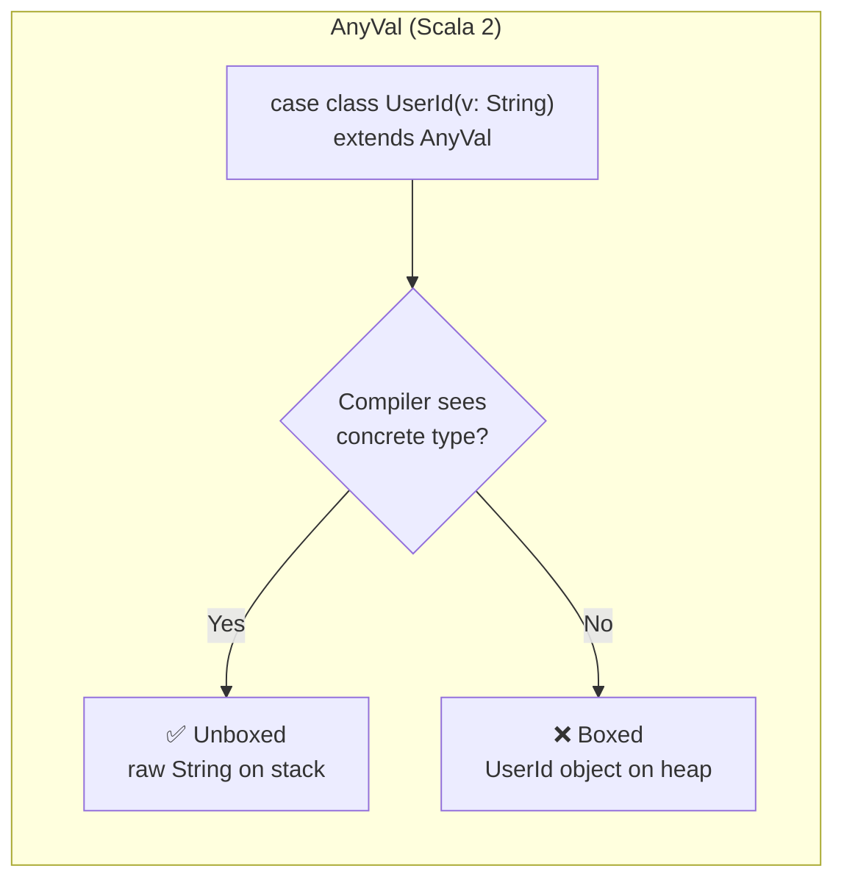
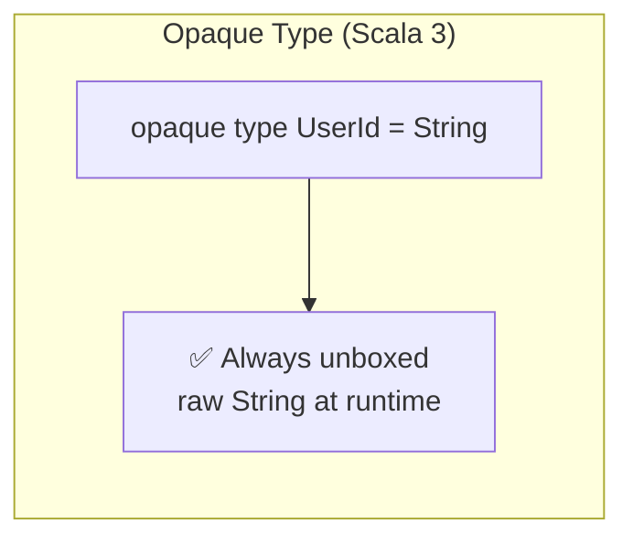

# Zero-Cost Type Class Derivation for Scala 3 Opaque Types

## What This Is

This project shows a pattern for **automatically deriving type class instances for opaque types** in Scala 3 — without writing a separate instance for each type, and with zero runtime overhead.

If you've ever defined a handful of opaque types (`UserId`, `OrderId`, `Email`, …) and then had to write nearly identical `StringCodec`, `JsonFormat`, or database-mapper instances for each one, this pattern eliminates that repetitive boilerplate. You write one generic derivation rule and one line per opaque type, and the compiler does the rest.

**What you'll learn in this guide:**

1. How opaque types work and their "inside vs. outside" visibility rule
2. The problem: why the compiler can't automatically reuse a `StringCodec[String]` as a `StringCodec[UserId]`
3. The solution: using type equality evidence (`=:=`) and `inline given` to derive instances generically
4. How to apply the pattern to real serialization libraries (Spray JSON as an example)
5. How to generalize it beyond `String` to any underlying type

## Background: Opaque Types in Scala 3

### Why zero-overhead types matter

Wrapping a value in an object just to give it a distinct type isn't free on the JVM. Each wrapper means an extra heap allocation, and in performance-sensitive code those small costs add up — especially when you're creating and discarding many short-lived wrappers.

Scala 2's `AnyVal` was designed to help. When you defined a class extending `AnyVal`, the compiler would try to represent instances using the underlying type at runtime, turning methods into static calls that operate on the unwrapped value. But this only held as long as the compiler could see the concrete `AnyVal` type. As soon as the value was seen through an abstract type, the wrapper object had to be allocated. You could never be sure whether a given use site was actually zero-cost or not.





Scala 3 introduced opaque types to provide a genuine zero-overhead guarantee. An opaque type exists only at compile time — at runtime it is always represented directly by its underlying type, with no wrapper, no allocation, and no boxing under any circumstances.

### What they look like

Scala 3's `opaque type` lets you create a brand-new type with zero runtime overhead:

```scala
object UserId:
  opaque type UserId = String

  def apply(value: String): UserId = value
```

This gives you two things at once:

- **Compile-time safety** — `UserId` and `String` are completely distinct types. You can't accidentally pass a `UserId` where an `OrderId` is expected, even though both are strings underneath.
- **Zero runtime cost** — at runtime, a `UserId` *is* just a `String`. There's no wrapper object, no extra allocation, no performance penalty.

### The Inside vs. Outside Rule

This is the single most important concept for understanding the rest of this guide.

An opaque type has two "faces" depending on where you look at it:

- **Inside the companion object** (where the opaque type is defined): the compiler knows that `UserId` is really `String`. You can freely assign a `String` to a `UserId` — for example, `def apply(value: String): UserId = value` compiles without any conversion.

- **Outside the companion object**: the compiler treats `UserId` as a completely separate type from `String`. It has no idea what the underlying type is. You cannot assign a `String` to a `UserId` or vice versa.

This boundary is what gives opaque types their safety — but it's also what creates the problem we're about to solve.

## The Problem: Type Classes Don't Cross the Boundary

### A concrete example of what goes wrong

Suppose you have a function that expects a `String`:

```scala
def greet(name: String): String = s"Hello, $name!"
```

If you try to call it with a `UserId`, the compiler refuses:

```scala
val uid = UserId("alice")
greet(uid)  // Compile error: Found UserId, Required: String
```

Outside the companion, `UserId` and `String` are different types. The compiler won't let you use one where the other is expected. That's the whole point of opaque types — but it creates a challenge when you need type class instances.

### The type class problem

Let's define a simple type class that represents bidirectional conversion to and from `String`:

```scala
trait StringCodec[T]:
  def encode(t: T): String
  def decode(s: String): T
```

This `T ⇄ String` pattern shows up everywhere — JSON serialization, URL parameter encoding, database column mapping, and so on.

The instance for `String` itself is trivial:

```scala
given StringCodec[String] with
  def encode(t: String): String = t
  def decode(s: String): String = s
```

Now here's the problem. Even though `UserId` is `String` at runtime, the compiler treats them as unrelated types. So `StringCodec[String]` doesn't satisfy a requirement for `StringCodec[UserId]`.

You *can* write the instance by hand inside the companion object, where the compiler knows the underlying type:

```scala
// Inside the companion, UserId = String is visible,
// so we can assign between them freely
given StringCodec[UserId] with
  def encode(t: UserId): String = t   // UserId → String works here
  def decode(s: String): UserId = s   // String → UserId works here
```

But repeating this for `OrderId`, `Email`, `SKU`, and every other opaque type means writing the same code over and over. The implementations are identical — only the type name changes.

## The Key Insight: Type Equality Evidence (`=:=`)

The solution builds on a Scala feature called **type equality evidence**.

### What is `=:=`?

`=:=` (pronounced "is equal to") is a type defined in `scala.Predef`. An instance of `T =:= String` is a **proof object** — it's the compiler's way of saying "I can guarantee that `T` and `String` are the same type."

You can't create `=:=` instances yourself. Only the compiler can provide them, and only when the equality genuinely holds. When you write:

```scala
summon[UserId =:= String]
```

…the compiler either proves the types are equal and hands you the evidence, or refuses to compile.

### What can you do with `=:=` evidence?

Once you have an evidence value `ev: T =:= String`, it doubles as a conversion function:

```scala
ev(t)        // converts T → String
ev.flip(s)   // converts String → T
```

These conversions are identity operations at runtime — they exist only to satisfy the type system. No actual data transformation happens.

### How `=:=` interacts with opaque types

This is where the inside/outside rule comes back:

- **Inside the companion object**: the compiler knows `UserId = String`, so it can provide `UserId =:= String` evidence. `summon[UserId =:= String]` succeeds.
- **Outside the companion object**: the compiler sees `UserId` as opaque — it doesn't know the underlying type. `summon[UserId =:= String]` fails to compile.

```scala
object UserId:
  opaque type UserId = String

  // Inside: the compiler knows UserId = String
  val evidence = summon[UserId =:= String]  // ✓ compiles

// Outside: the compiler doesn't know what UserId is
val evidence = summon[UserId =:= String]    // ✗ compile error
```

So we need two things: a generic derivation rule that works in terms of `=:=`, and a way to make the evidence available outside the companion.

## The Solution: Generic Inline Derivation + Exported Evidence

### Step 1: The generic derivation rule

We define a derivation rule in `StringCodec`'s companion object that works for *any* type the compiler can prove is equal to `String`:

```scala
object StringCodec:

  given StringCodec[String] with
    def encode(t: String): String = t
    def decode(s: String): String = s

  // Factory method: given conversion functions, build a StringCodec
  private def fromConversion[T](
    to: T => String,
    from: String => T
  ): StringCodec[T] =
    new StringCodec[T]:
      def encode(t: T): String = to(t)
      def decode(s: String): T = from(s)

  // For any type T that the compiler can prove equals String,
  // automatically create a StringCodec[T]
  inline given derived[T](using inline ev: T =:= String): StringCodec[T] =
    fromConversion(ev(_), ev.flip(_))
```

Let's break down the `derived` method:

- **`inline given derived[T]`** — this is a generic given (sometimes called a "blanket given"): it can produce a `StringCodec` for *any* type `T`. The `inline` keyword tells the compiler to resolve everything at compile time and expand the body inline, so nothing remains at runtime.
- **`(using inline ev: T =:= String)`** — this constrains which types `T` qualify. The compiler will only use this rule when it can prove `T =:= String`. Only types that are genuinely equal to `String` — including opaque types defined as `String` — will match.
- **`fromConversion(ev(_), ev.flip(_))`** — uses the evidence as conversion functions. `ev(_)` converts `T → String` for encoding, and `ev.flip(_)` converts `String → T` for decoding.

Because everything is `inline`, the `=:=` conversions (which are identity casts) are erased entirely at compile time. The generated code has no conversion overhead, no allocation, no evidence object — just direct string operations.

### Step 2: Exporting the evidence

The derivation rule above requires `T =:= String` to be in implicit scope. But as we saw, the compiler can only prove `UserId =:= String` *inside* the companion. We need to "export" that knowledge so it's available outside:

```scala
object UserId:
  opaque type UserId = String

  def apply(value: String): UserId = value

  // Export the type equality evidence so it's available outside this object.
  // Inside here, the compiler knows UserId = String, so summon succeeds.
  // This given re-publishes that knowledge for external code to use.
  given UserId =:= String = summon
```

This line may look circular — we're defining a `given` using `summon`, which looks up a `given`. But it's not:

1. Inside this companion, the compiler already knows that `UserId = String` (it's a type alias here)
2. So `summon[UserId =:= String]` succeeds using the compiler's built-in evidence
3. The `given` declaration then re-exports that evidence so it's available outside the companion, where the type is opaque

Without this line, code outside the companion has no way to prove `UserId =:= String`, and the generic derivation won't fire.

This is still a significant win over writing codec instances by hand. You write **one line of evidence export** per opaque type, and you get derivation for *every* type class that uses the `=:=` pattern — `StringCodec`, JSON formats, database column mappers, and anything else you build this way.

## What the Compiler Does: Step by Step

When you write:

```scala
summon[StringCodec[UserId]]
```

…here's what happens behind the scenes:

1. **Search** — the compiler looks for a `StringCodec[UserId]` in implicit scope
2. **Match** — it finds `StringCodec.derived[T]` and tries `T = UserId`
3. **Prove** — `derived` requires `UserId =:= String`, so the compiler searches for that evidence. It finds the `given UserId =:= String` exported from `UserId`'s companion object
4. **Construct** — with the evidence in hand, the compiler calls `fromConversion(ev(_), ev.flip(_))` to build the codec
5. **Inline** — because both `derived` and `ev` are `inline`, the compiler expands everything at compile time. The `=:=` conversions (which are identity functions) are erased entirely, leaving zero runtime overhead

The result: you get a `StringCodec[UserId]` that is type-safe at compile time and free at runtime.

## Verification

With both pieces in place, the following resolves automatically from any call site:

```scala
summon[StringCodec[String]]   // identity codec (trivial)
summon[StringCodec[UserId]]   // derived via =:= evidence
```

## Scaling Up: Multiple Opaque Types

The pattern scales cleanly. Each new opaque type needs only the evidence export:

```scala
object OrderId:
  opaque type OrderId = String
  def apply(value: String): OrderId = value
  given OrderId =:= String = summon

object Email:
  opaque type Email = String
  def apply(value: String): Email = value
  given Email =:= String = summon

object SKU:
  opaque type SKU = String
  def apply(value: String): SKU = value
  given SKU =:= String = summon
```

All four types — `UserId`, `OrderId`, `Email`, `SKU` — now have `StringCodec` instances with no per-type codec boilerplate.

## Practical Example: Spray JSON Integration

Here's how `StringCodec` composes with a real serialization library. The following derives a Spray JSON `JsonFormat` from any available `StringCodec`:

```scala
// Any type that has a StringCodec automatically gets a JsonFormat.
// No need to write one per opaque type.
given sprayJsonFormat[T](using codec: StringCodec[T]): JsonFormat[T] with
  def write(t: T) = JsString(codec.encode(t))
  def read(json: JsValue): T =
    json match
      case JsString(s) => codec.decode(s)
      case other =>
        deserializationError(s"Expected JSON string, got $other")
```

Because `StringCodec[UserId]` is derived automatically, `sprayJsonFormat[UserId]` resolves with no additional wiring. The same applies to `OrderId`, `Email`, and every other opaque type that exports its evidence.

## Generalizing Beyond String

The same pattern works for any underlying type. Here's a version for `Long`-based opaque types:

```scala
trait LongCodec[T]:
  def encode(t: T): Long
  def decode(l: Long): T

object LongCodec:
  private def fromConversion[T](
    to: T => Long,
    from: Long => T
  ): LongCodec[T] =
    new LongCodec[T]:
      def encode(t: T): Long = to(t)
      def decode(l: Long): T = from(l)

  inline given derived[T](using inline ev: T =:= Long): LongCodec[T] =
    fromConversion(ev(_), ev.flip(_))
```

Replace `Long` with `Int`, `UUID`, `BigDecimal`, or any other type, and the technique works identically. You could also abstract over the base type itself with a higher-kinded `OpaqueCodec[T, U]`, though the single-base-type version is usually clearer in practice.

## Limitations

There are a few boundaries to be aware of.

### Opaque types only

This approach applies to **opaque types only**. Wrapper classes like `case class UserId(value: String)` don't produce `=:=` evidence and aren't covered. For wrapper classes, you're better served by deriving through the constructor and extractor directly.

### One line per opaque type

Each opaque type's companion must export its `=:=` evidence with an explicit `given`. This is a single line per type, but it *is* a line you have to remember to write. Forgetting it will produce a "no given instance found" error at the call site — the fix is straightforward once you know the pattern.

### Encapsulation tradeoff with `=:=`

**For most opaque types, this isn't a concern.** The typical opaque type is a simple type tag with no invariants — it exists for compile-time safety (don't mix `UserId` with `OrderId`), not to enforce constraints. The pattern works perfectly for this common case.

However, if your opaque type has **validation logic**, exporting `=:=` evidence creates a way to bypass it. Consider:

```scala
object Email:
  opaque type Email = String

  def apply(value: String): Either[String, Email] =
    if value.contains("@") then Right(value)
    else Left(s"Invalid email: $value")

  given Email =:= String = summon  // ← this opens a backdoor
```

The `apply` method enforces that every `Email` contains `@`. But the exported evidence provides a way around that:

```scala
import Email.given

val ev = summon[Email =:= String]
val bad: Email = ev.flip("not-an-email")  // bypasses validation entirely
```

This `Email` value was never checked by `apply` — it violates the invariant. The next section shows how to solve this using `<:<` instead.

## The `<:<` Approach: Safe Encoding for Validated Types

### The problem with `=:=` for validated types

As shown above, exporting `=:=` evidence gives you bidirectional conversion — anyone can go from `String` to your opaque type, bypassing any validation. For simple type tags that's fine, but for validated types you need a different approach.

### How `<:<` differs from `=:=`

`<:<` proves a **subtype** relationship (`A <: B`) rather than type **equality** (`A = B`). The key differences:

- `=:=` gives you bidirectional conversion: `ev(t)` for `T → String` and `ev.flip(s)` for `String → T`
- `<:<` gives you one-way conversion only: `ev(t)` for `T → String`. There is no `flip`.

More importantly, if you declare an opaque type with an **upper bound**, the `<:<` evidence is available outside the companion **automatically** — no export needed:

```scala
object ValidatedEmail:
  opaque type ValidatedEmail <: String = String
  //                        ^^^^^^^^^^
  //  This upper bound makes ValidatedEmail <:< String
  //  available to external code automatically.
```

### Splitting encode and decode

This one-way nature of `<:<` maps perfectly onto a split between encoding (always safe) and decoding (needs validation):

```scala
// Encode: T → String (automatic via <:<, no evidence export needed)
trait StringEncoder[T]:
  def encode(t: T): String

object StringEncoder:
  private def fromConversion[T](to: T => String): StringEncoder[T] =
    (t: T) => to(t)

  inline given derived[T](using inline ev: T <:< String): StringEncoder[T] =
    fromConversion(ev(_))

// Decode: String → T (must go through the smart constructor)
trait StringDecoder[T]:
  def decode(s: String): Either[String, T]

object StringDecoder:
  private def fromConversion[T](from: String => T): StringDecoder[T] =
    (s: String) => Right(from(s))

  inline given derived[T](using inline ev: T =:= String): StringDecoder[T] =
    fromConversion(ev.flip(_))
```

The `StringEncoder` derives automatically for any type with `<:< String` — including both `=:=` types (since `=:=` extends `<:<`) and upper-bounded types. The `StringDecoder` returns `Either`, giving the implementation a chance to reject invalid input.

### Using it with a validated opaque type

```scala
object ValidatedEmail:
  opaque type ValidatedEmail <: String = String

  def apply(value: String): Either[String, ValidatedEmail] =
    if value.contains("@") then Right(value)
    else Left(s"Invalid email: $value")

  // No =:= export — no backdoor.
  // Encoding works automatically via <:< from the upper bound.
  // Decoding goes through the smart constructor to enforce validation.
  given StringDecoder[ValidatedEmail] with
    def decode(s: String): Either[String, ValidatedEmail] = apply(s)
```

From external code:

```scala
// Encoding: resolves automatically, no export needed
val encoder = summon[StringEncoder[ValidatedEmail]]
encoder.encode(ve)  // "alice@example.com"

// Decoding: uses the hand-written instance, enforces validation
val decoder = summon[StringDecoder[ValidatedEmail]]
decoder.decode("alice@example.com")  // Right(alice@example.com)
decoder.decode("not-an-email")       // Left(Invalid email: not-an-email)

// No backdoor — this won't compile:
summon[ValidatedEmail =:= String]    // ✗ compile error
```

### Spray JSON integration with priority

The `StringEncoder` + `StringDecoder` pair composes into a `JsonFormat` the same way `StringCodec` does. To avoid ambiguity for types that have both `StringCodec` (via `=:=`) and `StringEncoder` + `StringDecoder` (via `<:<`), we use Scala's given priority mechanism — the `StringCodec`-based format takes precedence, and the encoder/decoder pair acts as a fallback:

```scala
object SprayJsonSupport extends LowPrioritySprayJsonSupport:
  // Higher priority: bidirectional codec (=:= types)
  given sprayJsonFormat[T](using codec: StringCodec[T]): JsonFormat[T] with
    def write(t: T) = JsString(codec.encode(t))
    def read(json: JsValue): T = json match
      case JsString(s) => codec.decode(s)
      case other => deserializationError(s"Expected JSON string, got $other")

trait LowPrioritySprayJsonSupport:
  // Lower priority: encoder + decoder pair (<:< types with validation)
  given sprayValidatedStringJsonFormat[T](using
    encoder: StringEncoder[T],
    decoder: StringDecoder[T]
  ): JsonFormat[T] with
    def write(t: T) = JsString(encoder.encode(t))
    def read(json: JsValue): T = json match
      case JsString(s) =>
        decoder.decode(s) match
          case Right(t) => t
          case Left(err) => deserializationError(err)
      case other => deserializationError(s"Expected JSON string, got $other")
```

This means `ValidatedEmail` gets a `JsonFormat` that serializes freely but **rejects invalid values on deserialization** — exactly what you want.

### When to use which

| Approach | Evidence | Export needed? | Encode | Decode | Validation safe? |
|----------|----------|---------------|--------|--------|-----------------|
| `=:=` | Type equality | Yes (1 line per type) | Automatic | Automatic | No |
| `<:<` | Upper bound | No | Automatic | Hand-written | Yes |

**Rule of thumb:** if your opaque type has no validation (just a type tag), use `=:=` for maximum convenience. If it enforces invariants, use an upper bound with `<:<` for encoding and a hand-written `StringDecoder` for decoding.

## Conclusion

By combining Scala 3's `opaque type`, type equality evidence (`=:=`), and `inline given`, you get type class derivation that is type-safe, zero-cost, and nearly boilerplate-free. The "compile-time distinct, runtime identical" nature of opaque types extends naturally into the type class world — you just need to bridge the boundary of the companion object by exporting the evidence.

For validated types, the subtype evidence (`<:<`) provided by an upper bound gives you automatic encoding without opening a backdoor to bypass validation. Decoding goes through a hand-written instance that enforces your constraints.

If your project makes heavy use of opaque types — and it should — introducing these patterns early will save you significant effort every time you add a new domain type.
